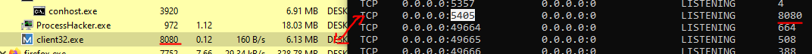
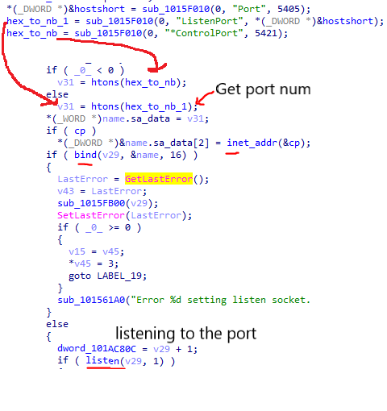
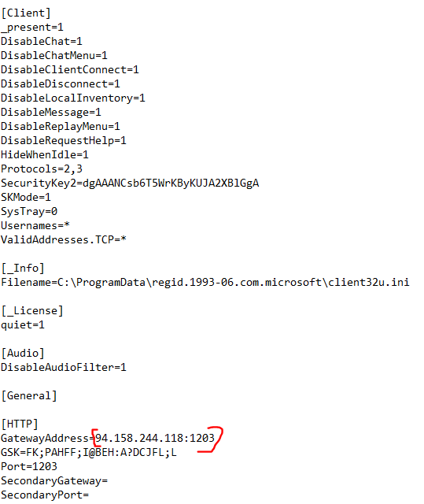
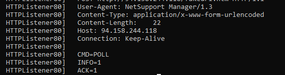
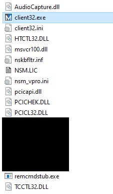

# T1219: Remote Access Software NetSupport

## Description

It is a remote access tool that allows attacker to take control on the system remotely. It requires the listener runs on the background.

So far the listener only listen on port `5405` or `5421`

These two libraries, `HTCTL32.dll`, `PCICL32.dll` and `TCCTL32.dll` did most of the job on the RAT feature.

Here is the IDAPro decompiler view on `TCCTL32.dll`

> There is a [SANS site](https://isc.sans.edu/services.html) which list down any port with its corresponding service.

The connecting server will be specified in `GateawayAddress` and the listener will ping them after the listener has been setup up.

Here is the first HTTP request from the listener to its connector after it starts listening to the port mentioned above.

Here are the files that locate together along with the listener in same folder.

## Hunt

### Network

Hunt for any suspicious port that listening to either `5405` or `5421` since this is hardcoded within the NetSupport tools. (Not sure if there is a setting on the listener builder that can modify the port number used)

## Reference

<https://isc.sans.edu/services.html>
