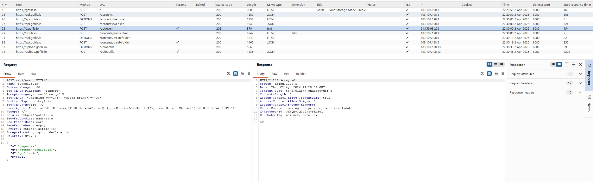
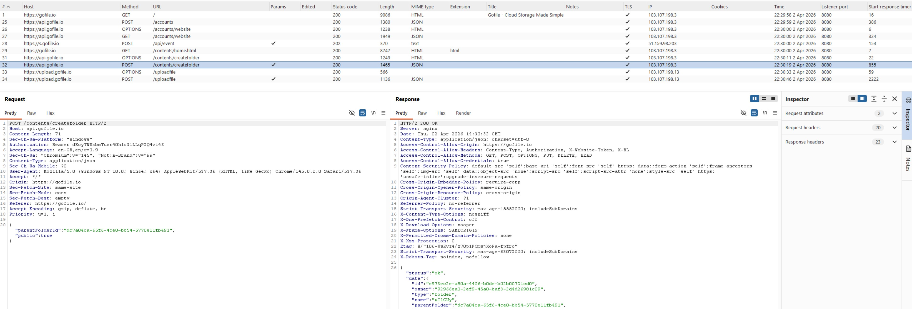
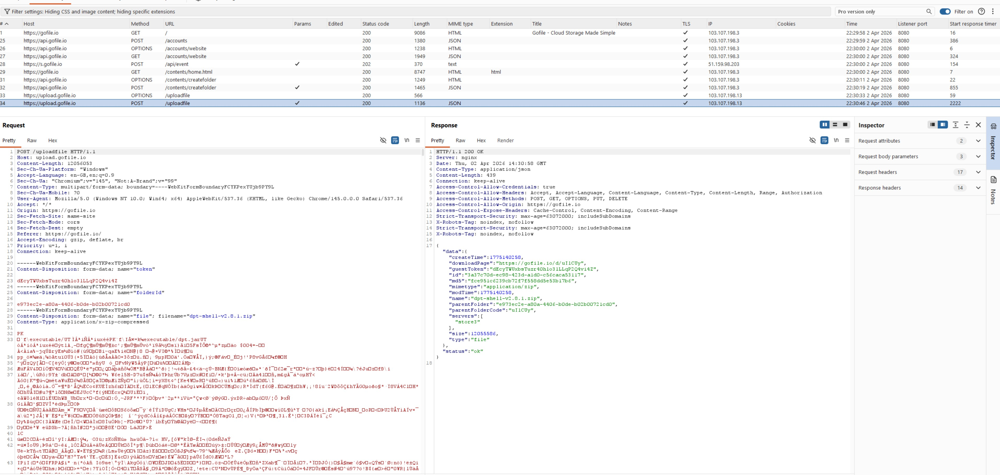
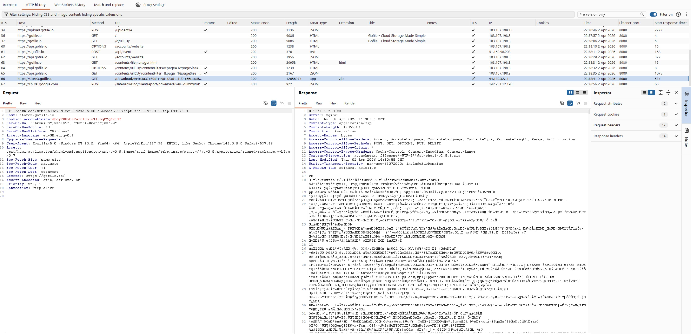
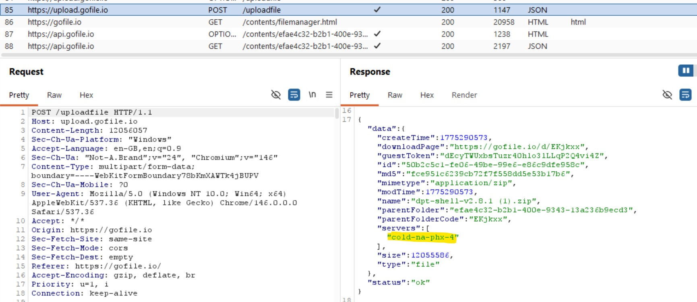

# T1567.002 Data Exfiltration via GoFile

## Description

Another data exfiltration to the cloud storage which is similar to pastebin, but it works on files instead of text. 

No sign up needed.

When user upload a folder to the site from a browser, several web url being called. We will be focusing on the POST request method since our scope is on the data exfiltration activity.

### URL Endpoint involved for data upload (POST request) 

1. `https://s.gofile.io/api/event`

2. `https://api.gofile.io/contents/createfolder` (Only invoked during the initial upload or when uploading to a folder that does not yet exist)

3. `https://upload.gofile.io/uploadfile`

### URL Endpoint involved for file download (GET request)

Download file from `https://<DOWNLOAD_SERVER>.gofile.io`, it can see that the URL length is very longer than other GoFile request.

The download server will be given when you upload the file via `https://upload.gofile.io/uploadfile` as of the URL response.

In this case, the download server will be `https://cold-na-phx-4.gofile.io`

Since the `servers` return an array, there might contain multiple download servers and randomly pick any one as the available download server.

## Hunt

Look up for the URL endpoint to determine any potential exfiltration or infiltration events.

Proper baseline (frequency of the requests for split data chunk upload, large content length request for bulk upload etc.) required to filter out potential noise if your environment allow the access to these sites.