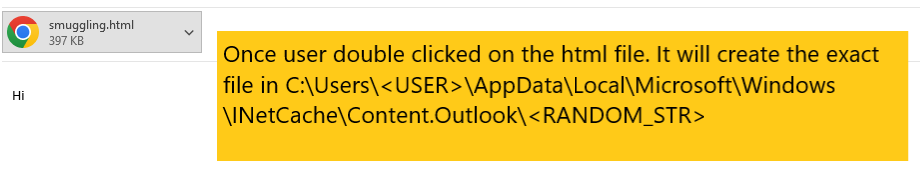
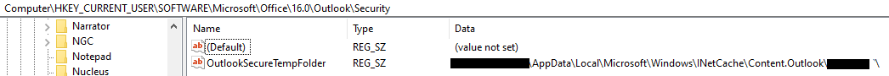
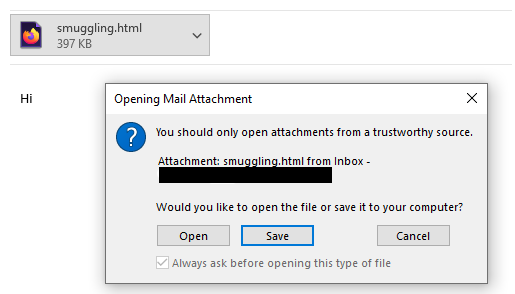
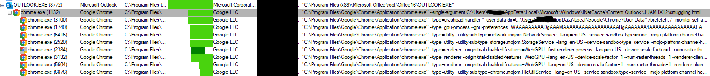
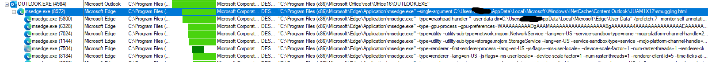
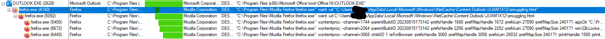

# T1027.006 - HTML Smuggling

## Description

Basically threat actor try to hide its payload, mostly an archive inside HTML with obfuscated scripting code (e.g. JScript)

### Outlook Cache File

It can be seen under `procmon` monitoring.

The attachment handling path has been declared in the key data of the `OutlookSecureTempFolder`.

Based on ChatGPT

> Security: This is a subkey under the Outlook key where security-related settings for Outlook are stored. These settings might include preferences for handling attachments, security prompts, macro settings, trusted senders, and other security-related features.

It will prompt a message box to remind user to only open file from trusted source. Click on `Open` and its behaviour will explain in next section.

### Process Behaviour

If the user double click on the HTML file, it will trigger the default browser to open the HTML file. It is good to know that the command line contains the HTML file to be opened.

Chrome

Edge

Firefox

When opening the HTML file itself, it executes the JScript inside the HTML file and immediately download/drop the payload that smuggled inside the HTML file into the `download` path.

When HTML file starts to download the archive file, the browser will generate `FileCreate` event that targeting the file to be download.

## Hunt

### Process Chain

Process Chain on Outlook.exe -> Browser Application (e.g. Edge, Firefox, Chrome etc.) that contains the HTML attachment name in command line
-> `FileCreate` event from the browser on downloading/dropping any archive file (e.g. .iso, .zip etc.)

## References

<https://thedfirreport.com/2023/08/28/html-smuggling-leads-to-domain-wide-ransomware/>