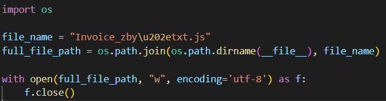
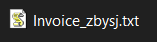
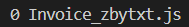

# T1547.001 - Masquerading: Right-to-Left Override

Unicode `\u202e` will force characters after it starts from right to left.

Simple script to create a file with rtlo name.

File name when it is view from Windows GUI (explorer windows)

File name when it is view from `dir` command (The display just ignore the rtlo character)

## Hunt

Look into EDR/MDR log data that contains any:  
Unicode value: `\u202e` or `U+202e` or `%u202e`  
Hex value: `%e2%80%ae`
Decimal value: `226`,`128`,`174`

Probably some of the EDR/MDR might already encoded the data with utf-8.

## References

<https://redcanary.com/blog/right-to-left-override/>
