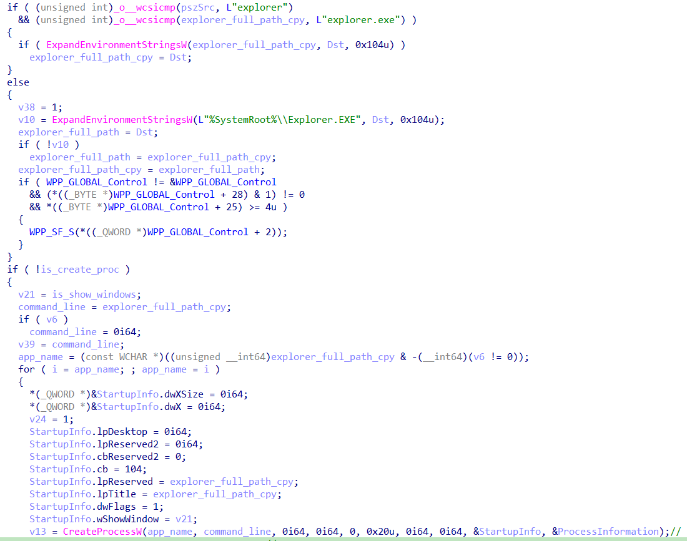

# T1037 - Boot or Logon Initialization Scripts

HKCU\Environment\UserInitMprLogonScript
HKLM\Environment\UserInitMprLogonScript

Script execution flow

Support script file Only, since the ExeApplication only support CreateProcess for explorer.exe

## References

<https://blogs.blackberry.com/en/2013/09/windows-registry-persistence-part-2-the-run-keys-and-search-order>
<https://en.wikipedia.org/wiki/Booting_process_of_Windows_NT_before_Vista>
<https://en.wikipedia.org/wiki/Booting_process_of_Windows_NT_since_Vista>