# T1046 - Network Discovery Nmap Scan

## Description

There are different techniques used by nmap to scan for the network port of a machine. Each technique will use different combination of packet type.

There are 3 types of port status:

- **Open**: A service is hosted on the port and its active
- **Filtered**: The port probably hide behind firewall
- **Closed**: Port is closed and not available

All nmap port scan tecnique can be found in its [official site](https://nmap.org/book/man-port-scanning-techniques.html).

Most of these techniques has been well explained, check [References](#references) section for more info.

As per nmap [site](https://nmap.org/book/scan-methods-null-fin-xmas-scan.html) stated on `FIN`, `NULL`, and `XMAS` scan:

> The big downside is that **not all systems follow RFC 793** to the letter. A number of systems send RST responses to the probes regardless of whether the port is open or not. This causes all of the ports to be labeled closed. Major operating systems that do this are **Microsoft Windows**, many **Cisco devices**, and **IBM OS/400**.

Based on the statement above, it can be seen that why the scan in the test machine is not working since it is using TCP RFC 9293

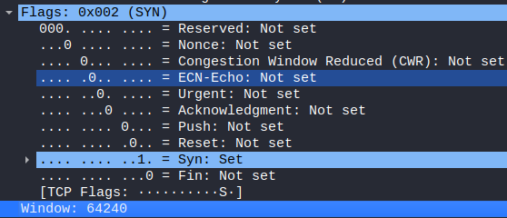

It can be seen that there are extra flag type in TCP RFC 9293 (`CWR` and `ECE`) compared to TCP RFC 793.

### TCP RFC 9293

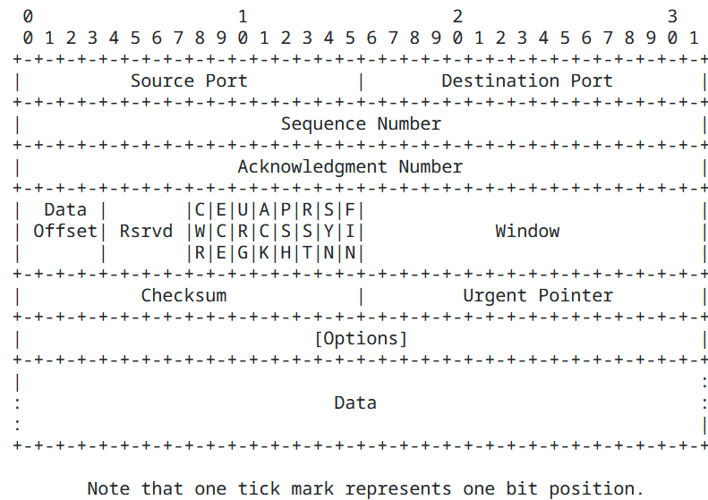

### TCP RFC 793

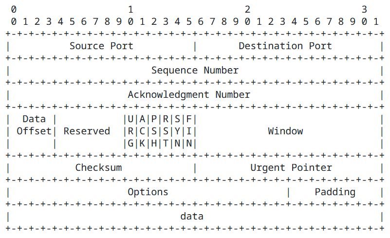  

The pdf [here](https://dl.packetstormsecurity.net/papers/general/demystifying-nmap.pdf) explained the wireshark analysis on those nmap scanning techniques.

## TCP Flags

|TCP Flags|Wireshark Filter|
|---|---|
|FIN|tcp.flags==0x1|
|SYN|tcp.flags==0x2|
|RST|tcp.flags==0x4|
|PSH|tcp.flags==0x8|
|ACK|tcp.flags==0x10|
|URG|tcp.flags==0x20|
|SYN, ACK|tcp.flags==0x12|
|FIN, ACK|tcp.flags==0x14|

### Tcp Scan

```cmd
nmap -sT <Target_IP>
```

Result when port is active:

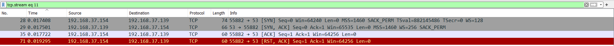

### Stealth Scan

```cmd
nmap -sS <Target_IP>
```

Result when port is active:

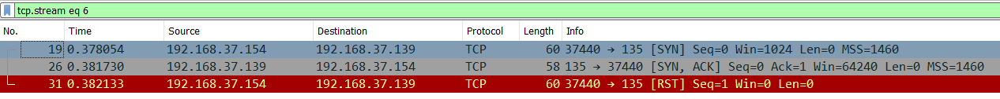

### Fin Scan

```cmd
nmap -sF <Target_IP>
```

Results when port is not active:

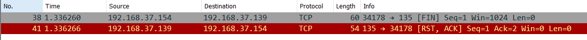

A positive result will not have `RST` send back to the scanner machine.

### Null Scan

```cmd
nmap -sN <Target_IP>
```

Results when port is not active:

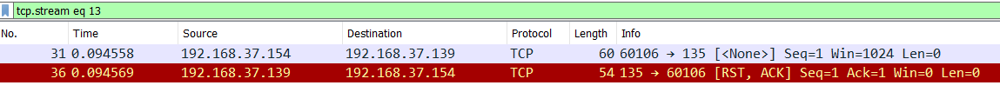

A positive result will not have `RST` send back to the scanner machine.

### Xmas Scan

```cmd
nmap -sX <Target_IP>
```

Results when port is not active:

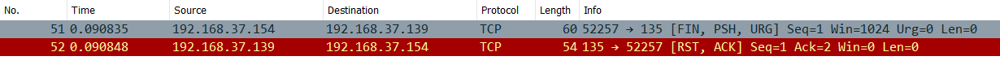

A positive result will not have `RST` send back to the scanner machine.

## Service Version scan

Usually `-sV`, `-sC` switch will be used to get the service information.

This will trigger the execution of lua based [NSE Library](https://github.com/nmap/nmap/tree/master/nselib) and also [NSE Scripts](https://github.com/nmap/nmap/tree/master/scripts)

These probe packets will change according to the service/protocol
detected.

### Example on port 80, Web IIS in Windows Server

```cmd
nmap -sV <Target_IP>
```

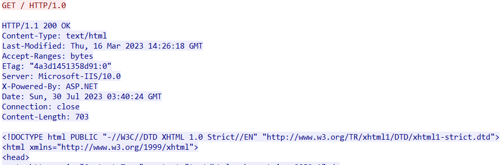

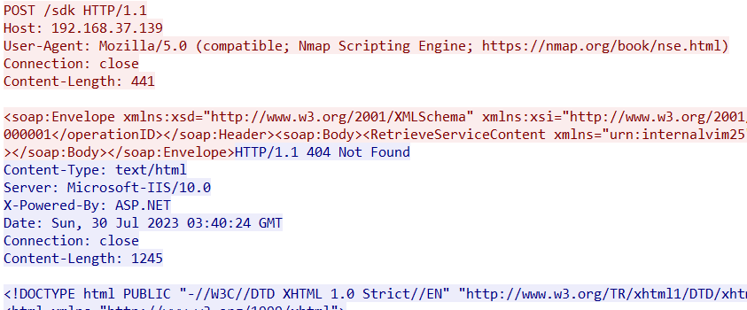

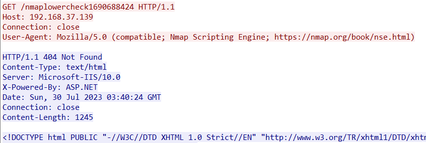

Nmap User-Agent can be seen if web server is detected.

Nselib `http.lua` can be found [here](https://github.com/nmap/nmap/blob/master/nselib/http.lua)

## OS Fingerprinting

When nmap doing `-O` fingerprinting scan, nmap will send a series of IP probes to the host.

Technical details can be found in [nmap site](https://nmap.org/book/osdetect-methods.html)

### Sequence generation (SEQ, OPS, WIN, and T1)

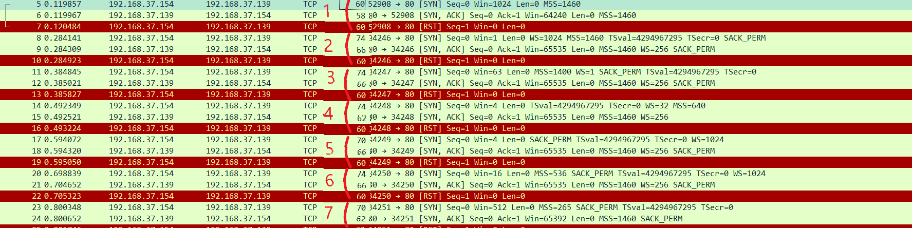

### TCP explicit congestion notification (ECN)

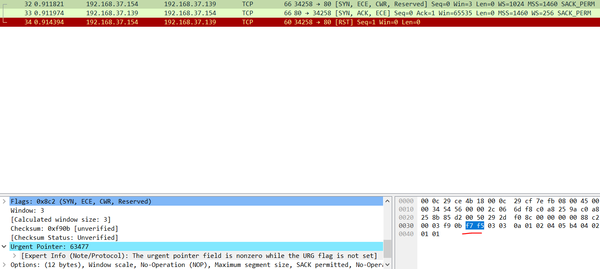

### TCP T2-T7

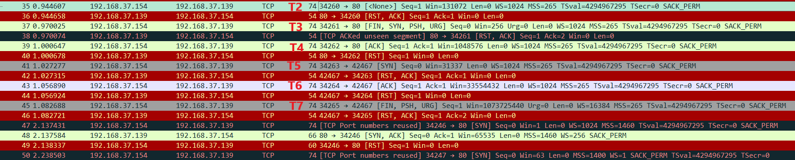

### ICMP echo (IE)

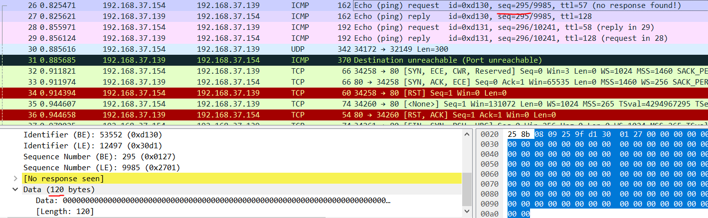

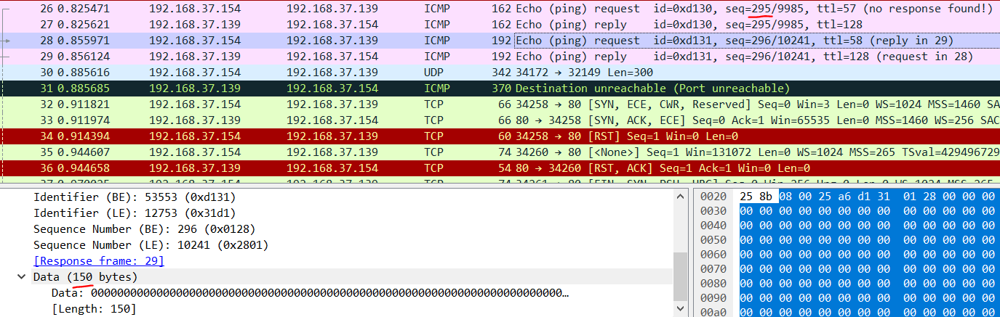

### UDP (U1)

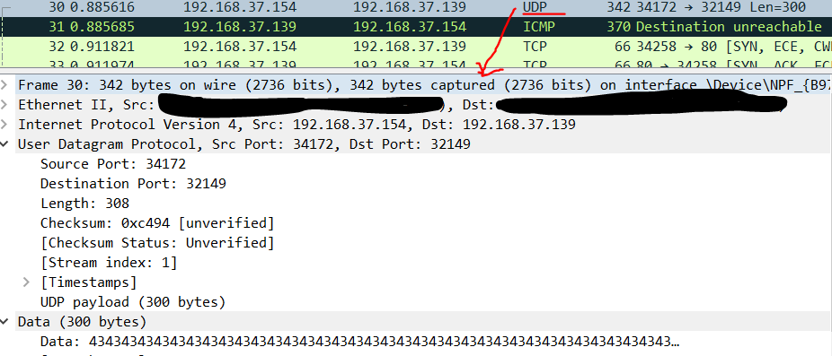

[nmap-service-probes](https://nmap.org/book/vscan-fileformat.html)
will be match against the probe results and determine host OS or service type hosted.

## Hunt

### Port scan

Multiple port being scanned from single IP in short period of time.

### Service scan hunt

Usually nmap will have their own fingerprint when perform those scanning. There is more explaination over [here](https://www.bencteux.fr/posts/nmap_detection/)

### OS Fingerprinting

Identify the sequnce of probe mentioned above in short period of time.

## References

<http://www.myreadingroom.co.in/notes-and-studymaterial/68-dcn/850-tcp-segment.html>  
<https://nmap.org/book/man-port-scanning-techniques.html>  
<https://medium.com/@avirj/nmap-tcp-syn-scan-50106f818bf1>  
<https://upadhyayraj.medium.com/nmap-xmas-scan-idle-scan-fin-scan-null-scan-b95a5c73bef6>  
<https://medium.com/@Aircon/nmap-advanced-port-scans-tryhackme-thm-ed3859a33eca>
<https://dl.packetstormsecurity.net/papers/general/demystifying-nmap.pdf>  
<https://datatracker.ietf.org/doc/html/rfc9293#name-header-format>  
<https://datatracker.ietf.org/doc/html/rfc793#page-15>  
<https://www.bencteux.fr/posts/nmap_detection/>  
<https://nmap.org/book/osdetect-methods.html>  
<https://www.secureideas.com/blog/how-to-create-custom-probes-for-nmap-service/version-detection>  
