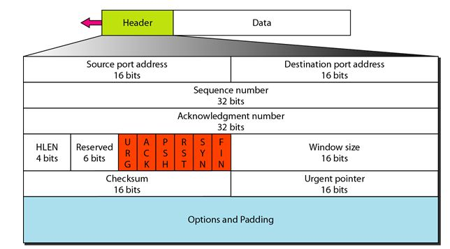

# T1046 - Network Discovery Nmap Scan

## Description

There are different techniques used by nmap to scan for the network port of a machine. Each technique will use different combination of packet type.

There are 3 types of port status:

- Open: A service is hosted on the port and its active
- Filtered: The port probably hide behind firewall
- Closed: Port is closed and not available

TCP header view, taken from www.myreadingroom.co.in

  

All nmap port scan tecnique can be found in its [official site](https://nmap.org/book/man-port-scanning-techniques.html).

Most of these techniques has been well explained, check [References](#references) section for more info.

As per nmap [site](https://nmap.org/book/scan-methods-null-fin-xmas-scan.html) stated on `FIN`, `NULL`, and `XMAS` scan:

> The big downside is that **not all systems follow RFC 793** to the letter. A number of systems send RST responses to the probes regardless of whether the port is open or not. This causes all of the ports to be labeled closed. Major operating systems that do this are **Microsoft Windows**, many **Cisco devices**, and **IBM OS/400**.

The pdf [here](https://dl.packetstormsecurity.net/papers/general/demystifying-nmap.pdf) explained the wireshark analysis on those nmap scanning techniques.

## TCP Flags

|TCP Flags|Wireshark Filter|
|---|---|
|FIN|tcp.flags==0x1|
|SYN|tcp.flags==0x2|
|RST|tcp.flags==0x4|
|PSH|tcp.flags==0x8|
|ACK|tcp.flags==0x10|
|URG|tcp.flags==0x20|
|SYN, ACK|tcp.flags==0x12|
|FIN, ACK|tcp.flags==0x14|

### Tcp Scan

```cmd
nmap -sT <Target_IP>
```

Result when port is active:


### Stealth Scan

```cmd
nmap -sS <Target_IP>
```

Result when port is active:


### Fin Scan

```cmd
nmap -sF <Target_IP>
```

Results when port is not active:


A positive result will not have `RST` send back to the scanner machine.

### Null Scan

```cmd
nmap -sN <Target_IP>
```

Results when port is not active:


A positive result will not have `RST` send back to the scanner machine.

### Xmas Scan

```cmd
nmap -sX <Target_IP>
```

Results when port is not active:


A positive result will not have `RST` send back to the scanner machine.

## References

<http://www.myreadingroom.co.in/notes-and-studymaterial/68-dcn/850-tcp-segment.html>  
<https://nmap.org/book/man-port-scanning-techniques.html>  
<https://medium.com/@avirj/nmap-tcp-syn-scan-50106f818bf1>  
<https://upadhyayraj.medium.com/nmap-xmas-scan-idle-scan-fin-scan-null-scan-b95a5c73bef6>  
<https://medium.com/@Aircon/nmap-advanced-port-scans-tryhackme-thm-ed3859a33eca>
<https://dl.packetstormsecurity.net/papers/general/demystifying-nmap.pdf>  
