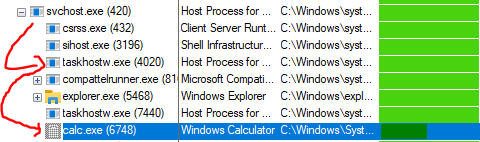
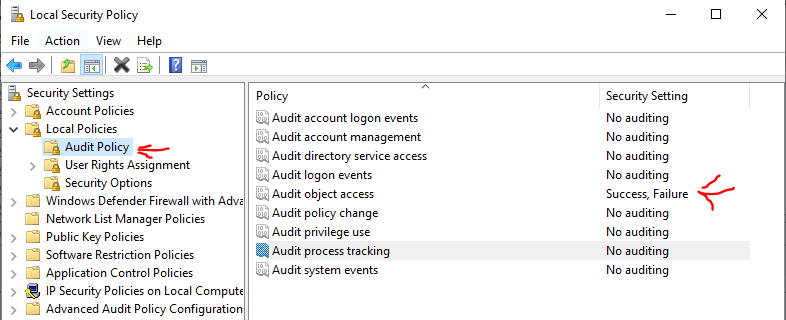

# T1053.005 - Scheduled Task/Job: Scheduled Task

There is a detailed analysis from [nasbench](https://nasbench.medium.com/a-deep-dive-into-windows-scheduled-tasks-and-the-processes-running-them-218d1eed4cce).

Here is another great analysis from [wit0k](https://github.com/wit0k/tarrask/blob/main/Tarrask_Persistence_Deep_Dive.pdf).

## Command Line Execution From schtasks.exe

Create schedule task that will execute calc.exe every 5 minutes  

```cmd
schtasks.exe /create /sc minute /mo 5 /tn this_is_test /tr c:\windows\system32\calc.exe /ru "<USER_NAME>"
```

Delete the task with specific task name  

```cmd
schtasks.exe /Delete /TN "this_is_test" /f
```

## Analysis

If you run `schtask.exe`, it will execute the task via `[IRegisteredTask]::RunEx` or `[IRegisteredTask]::Run`
and then it will redirect into `svchost.exe` which will initialize `taskhostw.exe` and execute the schedule task (In this case, it is  `calc.exe`)

> As mentioned nasbench blog, this kind of execution flow starts from Windows 10 Version 1511



Cmdline details for respective processes:

- C:\Windows\system32\svchost.exe -k netsvcs -p
- taskhostw.exe {222A245B-E637-4AE9-A93F-A59CA119A75E}
- C:\Windows\System32\calc.exe

All the schedule task are stored as XML file and located in `C:\Windows\System32\Tasks`.

For example:

```XML
<?xml version="1.0" encoding="UTF-16"?>
<Task version="1.2" xmlns="http://schemas.microsoft.com/windows/2004/02/mit/task">
  <RegistrationInfo>
    <Date>2024-12-12T20:15:11.4313107</Date>
    <Author>HOST_NAME</Author>
    <URI>\TEST</URI>
  </RegistrationInfo>
  <Principals>
    <Principal id="Author">
      <UserId>S-1-5-21-\d{10}-\d{8}-\d{9}-\d{4}</UserId>
      <LogonType>InteractiveToken</LogonType>
      <RunLevel>HighestAvailable</RunLevel>
    </Principal>
  </Principals>
  <Settings>
    <DisallowStartIfOnBatteries>true</DisallowStartIfOnBatteries>
    <StopIfGoingOnBatteries>true</StopIfGoingOnBatteries>
    <Enabled>false</Enabled>
    <MultipleInstancesPolicy>IgnoreNew</MultipleInstancesPolicy>
    <IdleSettings>
      <StopOnIdleEnd>true</StopOnIdleEnd>
      <RestartOnIdle>false</RestartOnIdle>
    </IdleSettings>
  </Settings>
  <Triggers>
    <CalendarTrigger>
      <StartBoundary>2024-12-12T20:14:34</StartBoundary>
      <Repetition>
        <Interval>PT5M</Interval>
        <Duration>P1D</Duration>
      </Repetition>
      <ScheduleByDay>
        <DaysInterval>1</DaysInterval>
      </ScheduleByDay>
    </CalendarTrigger>
  </Triggers>
  <Actions Context="Author">
    <Exec>
      <Command>C:\Windows\System32\calc.exe</Command>
    </Exec>
  </Actions>
</Task>
```

## Hunt

**Windows Logs**  
Enable this in `Local Policies` -> `Audit Policy` -> `Audit object access`



Looking for security event log event ID:  

- 4698 - Other Object Access Events
  - A scheduled task was created
- 4700 - Other Object Access Events
  - A scheduled task was enabled
- 4702 - Other Object Access Events
  - A scheduled task was updated

**Application and Services Logs**  
Microsoft -> Windows -> TaskScheduler -> Operational

- 110 - Task triggered by user
  - Task Scheduler launched "{\<UUID>}"  instance of task "\\<TASK_NAME\>"  for user "\<USER\>".
- 100 - Task Started
  - Task Scheduler started "{\<UUID>}" instance of the "\\<TASK_NAME\>" task for user "\<USER\>".
- 129 - Created Task Process
  - Task Scheduler launch task "\<TASK_NAME>" , instance "\\<TASK_RUN\>"  with process ID 1364.
- 200 - Action Started
  - Task Scheduler launched action "<TASK_RUN>" in instance "{\<UUID>}" of task "\<TASK_NAME\>".
- 201 - Action Completed
  - Task Scheduler successfully completed task "\\<TASK_NAME\>" , instance "{\<UUID>}" , action "\\<TASK_RUN\>" with return code 0.

**Tools**  
Execute [autoruns.exe](https://learn.microsoft.com/en-us/sysinternals/downloads/autoruns) and collect all the startup items which include schedule task.

## References

<https://learn.microsoft.com/en-us/windows/win32/taskschd/task-actions>
<https://nasbench.medium.com/a-deep-dive-into-windows-scheduled-tasks-and-the-processes-running-them-218d1eed4cce>
<https://learn.microsoft.com/en-us/windows/security/threat-protection/auditing/event-4698>
<https://ss64.com/nt/schtasks.html>  
<https://github.com/wit0k/tarrask/blob/main/Tarrask_Persistence_Deep_Dive.pdf>
