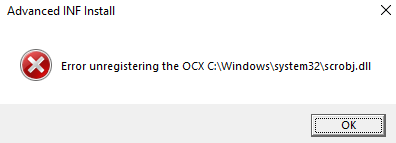

# T1218.011: Rundll32, INF->SCT

## Description

This TTP allows to code execution using DLL file by loading a `.inf` file.

`.inf` file contains a section which utilizing `scrobj.dll` to download a `.sct` file a execute it.

`.sct` file contains a `JScript` that will execute any function via ActiveX object.

## Payloads

sct payload [here](https://gist.githubusercontent.com/bohops/6ded40c4989c673f2e30b9a6c1985019/raw/33dc4cae00a10eb86c02b561b1c832df6de40ef6/test.sct)

inf file [here](https://gist.githubusercontent.com/bohops/693dd4d5dbfb500f1c3ace02622d5d34/raw/902ed953a9188b27e91c199b465cddf855c7b94f/test.inf)

ieuinit.inf [here](./ieuinit.inf)

## Execution

### 1) cmstp.exe

INF section must be `DefaultInstall_SingleUser`

```cmd
cmstp.exe /s <INF_FILE>
```

### 2) rundll32.exe advpack.dll

```cmd
rundll32.exe advpack.dll,LaunchINFSection <INF_FILE>,<INF_SECTION>,<CAB_FILE>,<INSTALLATION_FLAG>

Example:
rundll32.exe advpack.dll,LaunchINFSection test.inf,,1,
```

### 3) rundll32.exe ieadvpack.dll

```cmd
rundll32.exe ieadvpack.dll,LaunchINFSection <INF_FILE>,
<INF_SECTION>,<CAB_FILE>,<INSTALLATION_FLAG>

Example:
rundll32.exe ieadvpack.dll,LaunchINFSection test.inf,,1,
```

#### Type of LAUNCH_INF_SECTION

- LaunchINFSection  
- LaunchINFSectionA  
- LaunchINFSectionEx/LaunchINFSectionExA - Needs full path to execute, and will have a error prompt (Need further investigation to find out why)  
- LaunchINFSectionW/LaunchINFSectionExW - No able to find the inf file (Most probably the file name is not in wide char)

### 4) rundll32.exe setupapi.dll,InstallHinfSection

```cmd
rundll32.exe setupapi.dll,InstallHinfSection DefaultInstall 128 <INF_FILE>
```

### 5) iexpress.exe

`iexpress.exe` generates an executable in which contains a `cab` archive inside the `.rsrc` section named as `CABINET`

The `cab` archive contains the `.inf` and `advpack.dll` that will be extracted in `temp` folder during the execution.

The cab file will be loaded via [`FDICreate`](https://learn.microsoft.com/en-us/windows/win32/api/fdi/nf-fdi-fdicreate) and [`FDICopy`](https://learn.microsoft.com/en-us/windows/win32/api/fdi/nf-fdi-fdicopy)

```cmd
iexpress.exe /n <SED_FILE>
```

### 6) ie4uinit.exe

```cmd
ie4uinit.exe -BaseConfig
```

## Analysis

CoreInstall -> RegisterOCXs -> InstallOCX -> DoDllInst -> `scrobj.dll` loads the export `DllInstall()` -> `RegisterScriptlet()` will be handling the `.sct` file content download and code execution via `ComScriptletContext` and `ComScriptletSite` class

The text in `.inf` will be reach via [SetupGetLineTextW](https://learn.microsoft.com/en-us/windows/win32/api/setupapi/nf-setupapi-setupgetlinetextw)

The status result from `DllInstall()` return false that will cause the MsgBox appear after `InstallOCX`.



### Fetching .sct file content

The `.sct` content in the url fetches via [`CreateURLMonikerEx`](https://learn.microsoft.com/en-us/previous-versions/windows/internet-explorer/ie-developer/platform-apis/ms775103(v=vs.85))

[Here](https://github.com/ghoulgy/RandomCodes/blob/master/cpp/url_moniker_read_file_stream.cpp) is the simple demonstration
on how to use `CreateURLMonikerEx` to read url file content.

### Execution of the JScript

The JScript is loaded similar way in [here](https://github.com/ghoulgy/RandomCodes/blob/master/cpp/com_iactive_exec.cpp)

Here is the code function flow in `scrobj.dll` towards the code execution:

```text
Continue from RegisterScriptlet:
-> UnregisterObject -> RunRegistration -> CreateEngines(ScriptEngine::Compile)
```

## Hunts

**cmstp.exe / rundll32.exe advpack.dll,LaunchINFSection / rundll32.exe ieadvpack.dll,LaunchINFSection**  
Checking for process event in which the INF file has been passed in the command.

There is a FileRead event that INF has been read.

**ie4uinit.exe -BaseConfig**  
If this program and its config file `ieuinit.inf` are in the same path **NOT** in the `%SYSTEM%` path.  
For path checking, looking for the FileRead events on `ieuinit.inf` and initiating process path for `ie4uinit.exe`

**Network**  
Checking network connection (HTTP/S) for rundll32/ie4uinit that connects to suspicious IP/URL and download any suspicious `.sct` file.

## References

<https://bohops.com/2018/02/26/leveraging-inf-sct-fetch-execute-techniques-for-bypass-evasion-persistence/>  
<https://bohops.com/2018/03/10/leveraging-inf-sct-fetch-execute-techniques-for-bypass-evasion-persistence-part-2/>  
