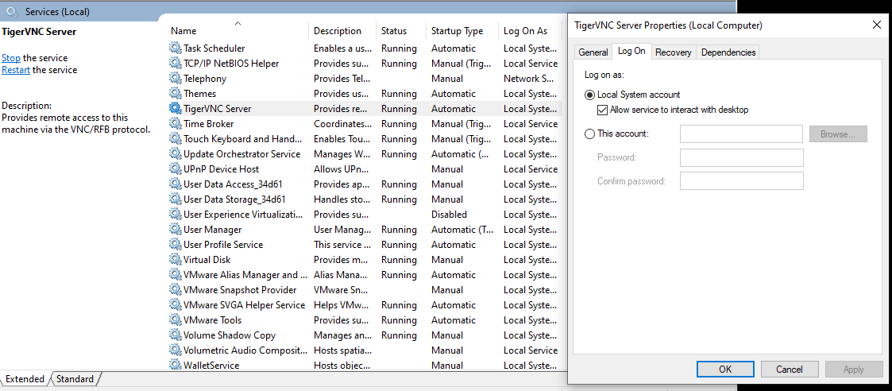
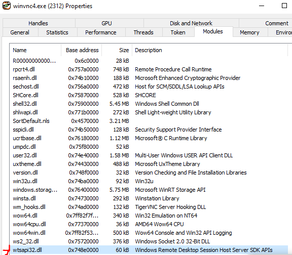

# T1219: Remote Access Software

## Description

Threat actor will install VNC software to control the victim machine remotely.

Listener will be the one installed in the victim system. So that, the threat actor can access it remotely.

Based on the test, the VNC listener will register as a service first.

### Ubuntu

#### 1. Listening host

- Install vnc package

```txt
sudo apt install vnctiger-standalone-server
```

- Run vncserver and enter password

- Setting up the xstartup file

  Copy gnome settings from [bytexd](https://bytexd.com/how-to-install-configure-vnc-server-on-ubuntu/) and paste into xstartup file

```txt
/.vnc/xstartup
chmod +x /.vnc/xstartup
```

- Start VNC listening on the host (Removed localhost only connection)

```txt
vncserver -localhost no :X
X is any decimal number
```

#### 2. Host connect to VNC server

```txt
vncviewer <LISTENING_HOST_IP>:<PORT e.g.590X>
```

### Windows

#### 1. Listening host

Download tigervnc-winvnc-1.13.1.exe from TigerVNC download page

#### 2. Host connect to VNC server

Download tigervnc64-1.13.1.exe from TigerVNC download page

## Hunt

- netstat -ano to show any listening servers with default port 590X
- VNC Process (Service) that runs the VNC server as the child of services.exe


> Listening port may be various based on the user settings

- Service related with VNC server


- Dll loaded wtsapi32.dll/wm_hooks.dll

  
## References

<https://bytexd.com/how-to-install-configure-vnc-server-on-ubuntu/>
<https://github.com/TigerVNC/tigervnc/releases>
