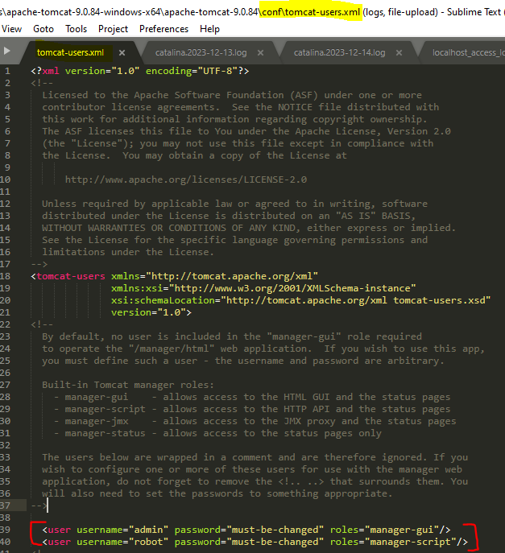
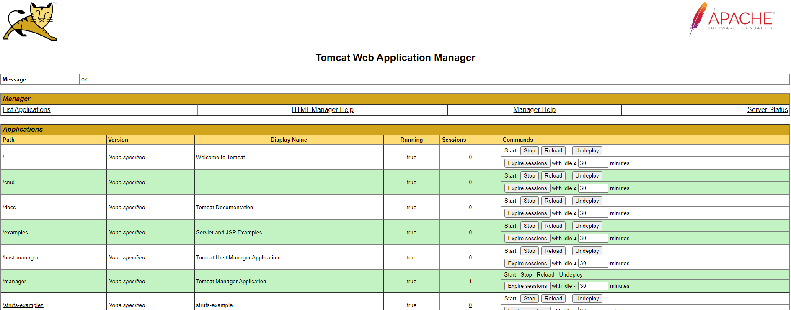
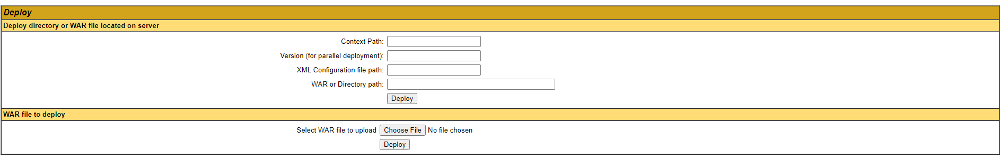
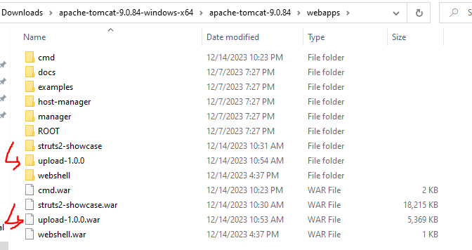
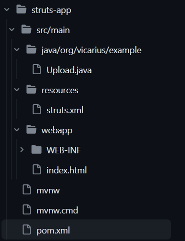
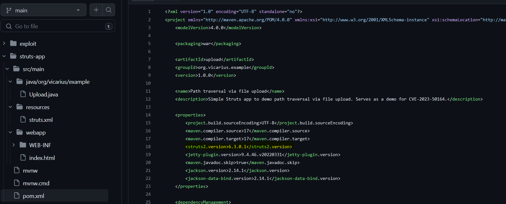
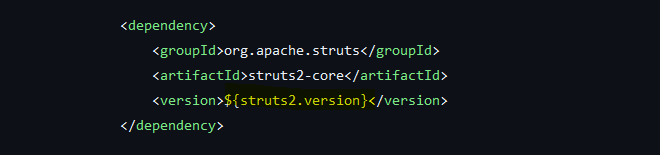
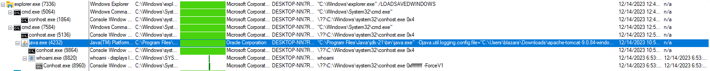

# T1505.003 - Web Archive (WAR) WebShell in Apache Web Server

## Setup

For Windows machine, go to `\bin` folder and execute `startup.bat` to run the tomcat server.

To make things easier, it is good to enable tomcat manager panel.

To enable it, remove the comment of the mentioned tag in the `conf\tomcat-users.xml`



Goto `localhost:8080/manager` and you will get a login prompt. Then, login using the credentials stated in the `conf\tomcat-users.xml`

After that, you will see list of applications hosted in the tomcat server.



You can deploy a web application by uploading WAR file or a web application directory.



Here is the `\webapps` folder that host the web application.



Folder structure for the web application with Struts framwork, the example is taken from [jakabakos](https://github.com/jakabakos/CVE-2023-50164-Apache-Struts-RCE/blob/main/struts-app/pom.xml):

> It is highly encourage to read through the example [here](https://struts.apache.org/getting-started/hello-world-using-struts2) to understand how struts framwork works.



The struts version can be set in `pom.xml` file as shown in the screenshots below.

The properties tag works like a variable which can be reused later.



The value in `struts2.version` can be get by enclosed them with placeholder `${}`



To get the `.war` file, run the following command and it will build the project. A folder named `target` will be created in the same folder where the mvn command executed during the mvn build and the `.war` file will be created if the build is success.

```cmd
c:\struts-app> mvn -e clean package
```

The Apache official github page do provide a comphensive example in [struts2-showcase](https://github.com/apache/struts/tree/master/apps) where user can build it from scratch using the mvn command above.

## Analysis

The default hosting path is `<APACHE_TOMCAT_PATH>/webapps/`. Once user upload the `.war` file, the webserver will extract the `.war` into a folder which contains the web application files. (Refer to the screenshot contains `\webapps` folder path)

> WAR basically contains bunch of component that build the web application (e.g. JSP, html, xml etc.)  

## Hunting

- Hunt for newly created files (especially .war files) within `/webapps/` folder or any custom web hosting path that configured in the web server.

- Hunt for any suspicious child process spawned by `java.exe` or `tomcat*.exe`



Process command line for `Java.exe`

```vmf
"C:\Program Files\Java\jdk-21\bin\java.exe"  -Djava.util.logging.config.file="C:\Users\user\Downloads\apache-tomcat-9.0.84-windows-x64\apache-tomcat-9.0.84\conf\logging.properties" -Djava.util.logging.manager=org.apache.juli.ClassLoaderLogManager  -Djdk.tls.ephemeralDHKeySize=2048 -Djava.protocol.handler.pkgs=org.apache.catalina.webresources   -Dignore.endorsed.dirs="" -classpath "C:\Users\user\Downloads\apache-tomcat-9.0.84-windows-x64\apache-tomcat-9.0.84\bin\bootstrap.jar;C:\Users\user\Downloads\apache-tomcat-9.0.84-windows-x64\apache-tomcat-9.0.84\bin\tomcat-juli.jar" -Dcatalina.base="C:\Users\user\Downloads\apache-tomcat-9.0.84-windows-x64\apache-tomcat-9.0.84" -Dcatalina.home="C:\Users\user\Downloads\apache-tomcat-9.0.84-windows-x64\apache-tomcat-9.0.84" -Djava.io.tmpdir="C:\Users\user\Downloads\apache-tomcat-9.0.84-windows-x64\apache-tomcat-9.0.84\temp" org.apache.catalina.startup.Bootstrap  start
```

- Hunt for any webshell related url path within apache web server logs, `*_access_log.txt` (Limited to url path, unfortunately it won't log the data content for the POST request)

## Refences

https://www.geeksforgeeks.org/create-and-setup-struts2-dynamic-web-application-in-eclipse/  
https://github.com/jakabakos/CVE-2023-50164-Apache-Struts-RCE/blob/main/struts-app/pom.xml  
https://struts.apache.org/getting-started/hello-world-using-struts2  
https://struts.apache.org/getting-started/how-to-create-a-struts2-web-application  
https://en.wikipedia.org/wiki/WAR_(file_format)  