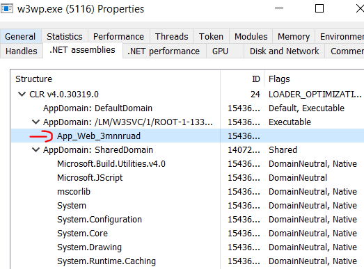
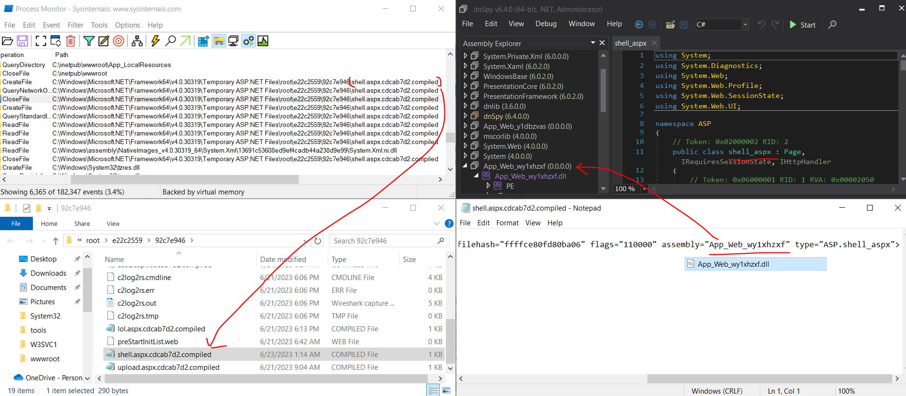
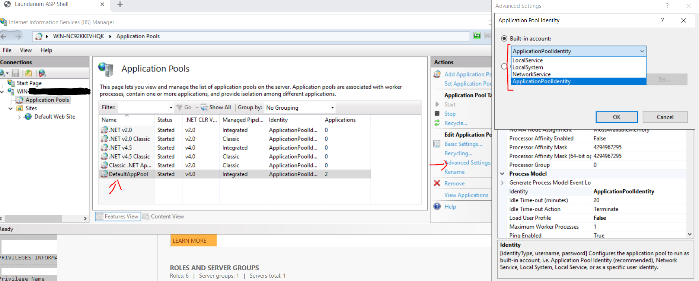
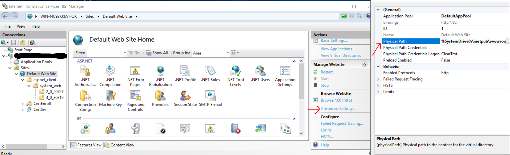
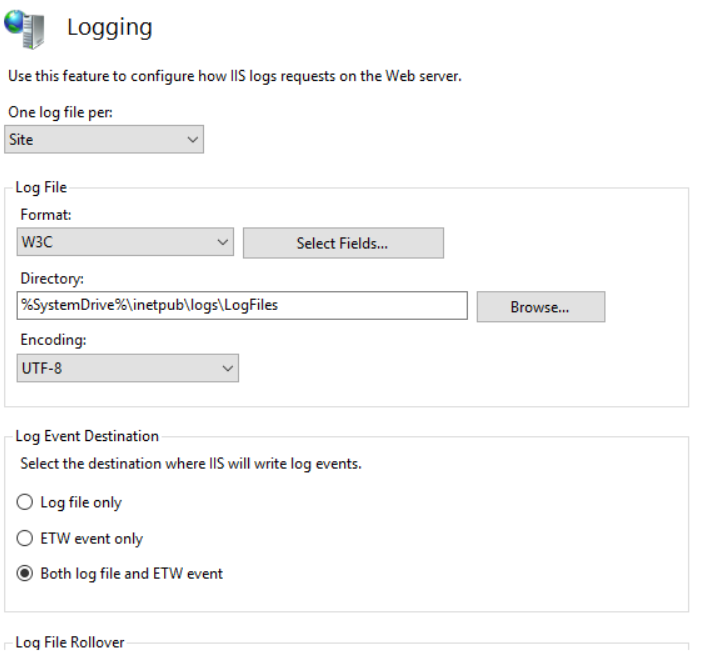
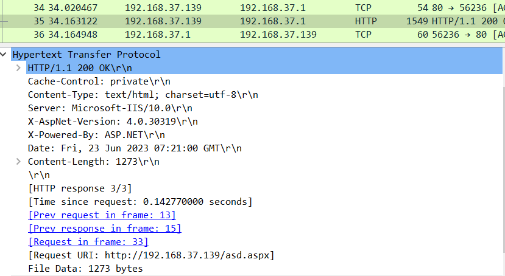
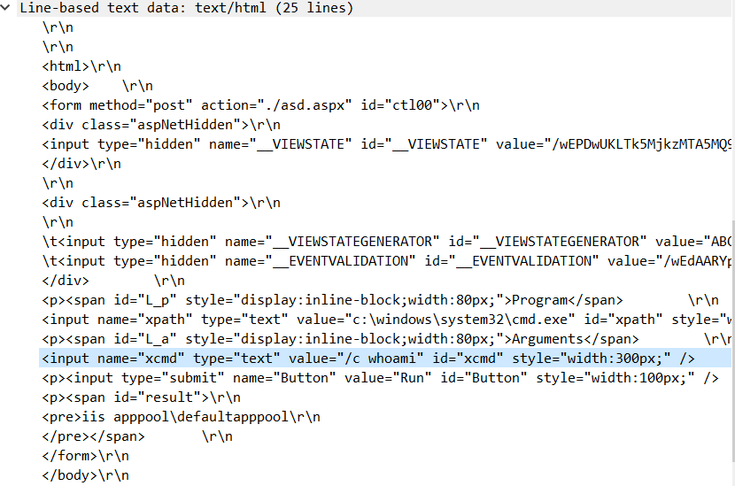
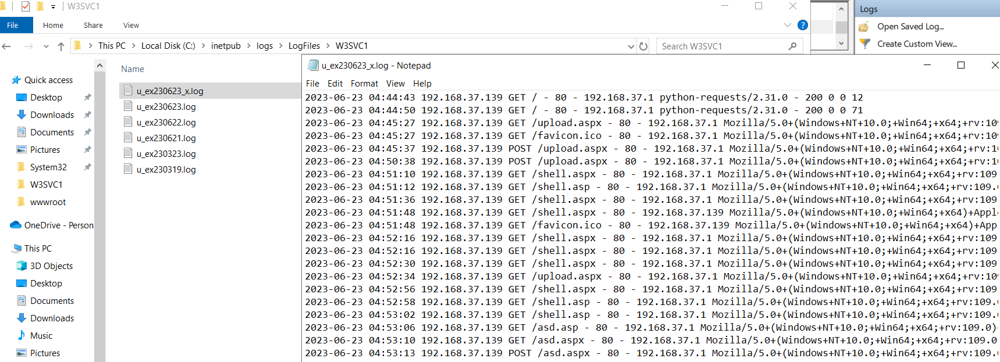
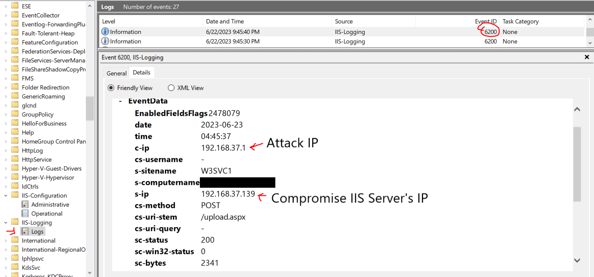

# T1505.003 - ASP/ASPX Web Shell

## Description

Based on explaination on Stackify, process `w3wp.exe` handles web request to the IIS web server. Attacker may upload asp/aspx web shell into the server and execute it by visiting the site that contains the web shell file.

### Execution of ASP/ASPX File

When user visits the asp/aspx file in IIS server, the `w3wp.exe` will compile the asp/aspx file into a DLL file and execute it.


It will loads into .net assemblies as well.



The artifact will left in the dotnet temp folder `C:\Windows\Microsoft.NET\Framework64\<VERSION_NUM>\Temporary ASP.NET Files\root\[A-Za-z0-9]{8}\[A-Za-z0-9]{8}`

The folder might changed based on the version of dotnet used.



The `.compiled` file will points to the DLL file that contains the asp/aspx web code.

### Default privilege details for web shell user

```cmd
USER INFORMATION
----------------

User Name                  SID                                                          
========================== =============================================================
iis apppool\defaultapppool S-1-5-82-


GROUP INFORMATION
-----------------

Group Name                                 Type             SID          Attributes                                        
========================================== ================ ============ ==================================================
Mandatory Label\High Mandatory Level       Label            S-1-16-XXXX                                                   
Everyone                                   Well-known group S-1-1-0      Mandatory group, Enabled by default, Enabled group
BUILTIN\Pre-Windows 2000 Compatible Access Alias            S-1-5-32-XXX Mandatory group, Enabled by default, Enabled group
BUILTIN\Users                              Alias            S-1-5-32-XXX Mandatory group, Enabled by default, Enabled group
BUILTIN\Certificate Service DCOM Access    Alias            S-1-5-32-XXX Mandatory group, Enabled by default, Enabled group
NT AUTHORITY\SERVICE                       Well-known group S-1-5-6      Mandatory group, Enabled by default, Enabled group
CONSOLE LOGON                              Well-known group S-1-2-1      Mandatory group, Enabled by default, Enabled group
NT AUTHORITY\Authenticated Users           Well-known group S-1-5-11     Mandatory group, Enabled by default, Enabled group
NT AUTHORITY\This Organization             Well-known group S-1-5-15     Mandatory group, Enabled by default, Enabled group
BUILTIN\IIS_IUSRS                          Alias            S-1-5-32-XXX Mandatory group, Enabled by default, Enabled group
LOCAL                                      Well-known group S-1-2-0      Mandatory group, Enabled by default, Enabled group
                                           Unknown SID type S-1-5-82-0   Mandatory group, Enabled by default, Enabled group


PRIVILEGES INFORMATION
----------------------

Privilege Name                Description                               State   
============================= ========================================= ========
SeAssignPrimaryTokenPrivilege Replace a process level token             Disabled
SeIncreaseQuotaPrivilege      Adjust memory quotas for a process        Disabled
SeMachineAccountPrivilege     Add workstations to domain                Disabled
SeAuditPrivilege              Generate security audits                  Disabled
SeChangeNotifyPrivilege       Bypass traverse checking                  Enabled 
SeImpersonatePrivilege        Impersonate a client after authentication Enabled 
SeCreateGlobalPrivilege       Create global objects                     Enabled 
SeIncreaseWorkingSetPrivilege Increase a process working set            Disabled
```

You may set the privilege level in IIS Manager



### Default Physical Path

The default phyiscal path is `%SystemDrive%\inetpub\wwwroot`



### Default Log Setting

By default, `log file only` is selected. User can enable both log file and ETW event and refer to ETW event since ETW reads from the raw log file.



## Hunt

### Anomaly child process

Here are the list of the processes that the threat actor may spawn through `w3wp.exe`

```cmd
cmd.exe, powershell.exe, cscript.exe, wscript.exe, net.exe, net1.exe, ping.exe, whoami.exe
```

It is quite common to have `cmd.exe`/`powershell.exe` process spawned under `w3wp.exe`, have to baseline it based on your environment.

### Writing asp web shell into rootpath

Any suspicious asp/aspx files has been wrote recently in `%SystemDrive%\inetpub\wwwroot`.

It needs to pivot with other telemetry such as file write/network events or baseline those files inside the `wwwroot` folder.

However the rootpath might different for each case, For example, ProxyShell exploit drop its web shell in `%ExchangeInstallPath%\FrontEnd\HttpProxy\owa\auth\`

### Write Access from w3wp.exe

It has limited write access to any windows folder when threat actor wants to upload their files with default IIS privilege which includes:

- the main drive folder (e.g. c:\\) and then create file within that folder.
- Some of the folder in `%ALLUSERSPROFILE%`, `C:\ProgramData` in Windows 10, e.g. [USOShared](https://forums.tomshardware.com/threads/anyone-know-whats-usoprivate-usoshared-is.2782860/)

> When user request any file from the IIS web server. There will have a file creation event on that. (e.g. When user access on shell.asp, File event will be trigger on shell.asp)

### Network (HTTP)

Check the data being receive from the attacker and vice versa.

The format might be different based on the `Content-Type` they used



If https protocol used, those data will get encrypted which makes the hunting work harder.



### Logs

These IIS logs contains information on the file that has been access by users, user-agent, source/destination IP, request method, request status etc.

These information can access from both raw log file or ETW logs with Event ID `6200` in IIS-Loggin Logs.





## References

<https://www.microsoft.com/en-us/security/blog/2022/12/12/iis-modules-the-evolution-of-web-shells-and-how-to-detect-them/>