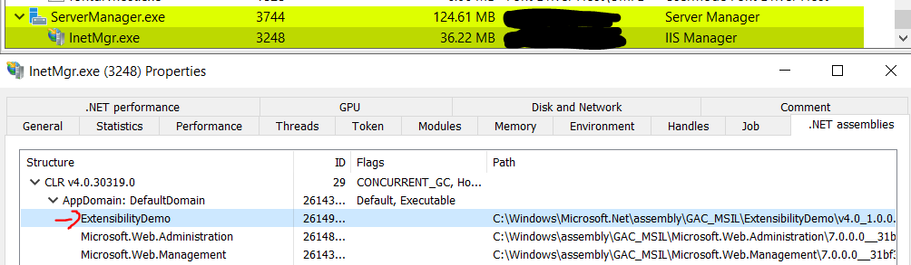

# T1505.004 - IIS Component

## Description

### 1. Install native IIS module via `appcmd.exe`

In this case, [IIS-Raid](https://github.com/0x09AL/IIS-Raid) from MDSec were used.

```cmd
C:\Windows\System32\inetsrv\appcmd.exe install module /name:IIS_Backdoor /image:"%windir%\System32\inetsrv\IIS-Backdoor.dll" /add:true
```

### 2. Install managed code via `gacutil.exe`

Install your `.dll` or `.exe` via `gacutil.exe` and it can be utilize later for module settings.

```cmd
"C:\Program Files (x86)\Microsoft SDKs\Windows\v10.0A\bin\NETFX 4.8 Tools\gacutil.exe" -i <DOT_NET_BINARY_FILE>
```

Checking If the module is installed

```cmd
"C:\Program Files (x86)\Microsoft SDKs\Windows\v10.0A\bin\NETFX 4.8 Tools\gacutil.exe" -l <DOT_NET_BINARY_FILE_NAME_WITHOUT_EXTENSION>
```

Add your module in `web.config`

```xml
<configuration>
  <system.webServer>
    <modules>
    <add name="MyModule" type="Namespace.MyModule, AssemblyName" />
    </modules>
  </system.webServer>
</configuration>

! Ignore this line when copy
e.g. <add name="myiis7project" type="myiis7project.Class1, myiis7project" />
```

Restart IIS server to refresh the memory in `w3wp.exe` to pick up the newly installed module.

The newly injected module will loaded in `w3wp.exe`


Here is the process tree to trigger `w3wp.exe` to spawn a `cmd.exe` to create a new directory named `lol` in `C:\ProgramData`


### 3. Create /bin folder

- Create `/bin` folder using web root directory e.g. `\wwwroot\bin` and insert the module file inside of it. Its info will be automatically pick up by `inetmgr`

- Manually add the module in `Modules` section in the `inetmgr`


**Extra**

User also can install for `InetMgr.exe`. Details [here](https://learn.microsoft.com/en-us/iis/develop/extending-the-management-ui/how-to-create-a-simple-iis-manager-module).



> Remember when open a new project in Visual Studio please select Class Library (.NET Framework)

## Hunt

### IIS Modules

How to create [create simple IIS Module](https://learn.microsoft.com/en-us/iis/develop/extending-the-management-ui/how-to-create-a-simple-iis-manager-module)

Looking for any suspicious modules loads by `appcmd.exe`

List all modules installed using:

```cmd
appcmd.exe list modules
```

Also can checking list of modules installed in the IIS web server via GUI


### Load modules in w3wp.exe

The suspicious modules will be loaded in `w3wp.exe` and there is no `Description` which makes it suspicious.


### File Write on web.config

Attacker have to add their malicious module into `web.config` to register it.

### Restart IIS server

Restart IIS server so that it will fetch the data in `web.config` and load the module.

### IIS Event Logs

There is a Event ID 50 (Level: Information) in `IIS-Configuration Operation` log that record down any changes on the `web.config`.

However, it doesn't provide much context on what changes has been done.


### Network

It is similar to (T1505.003 - IIS Web Shell), but the payload module here is IIS-Raid.


## Reference

<https://www.mdsec.co.uk/2020/02/iis-raid-backdooring-iis-using-native-modules/>  
<https://www.microsoft.com/en-us/security/blog/2022/07/26/malicious-iis-extensions-quietly-open-persistent-backdoors-into-servers/>  
<https://learn.microsoft.com/en-us/iis/develop/extending-the-management-ui/how-to-create-a-simple-iis-manager-module>  
<https://learn.microsoft.com/en-us/dotnet/standard/assembly/sign-strong-name>  
<https://www.youtube.com/watch?v=p6u7n_BPcVw>
