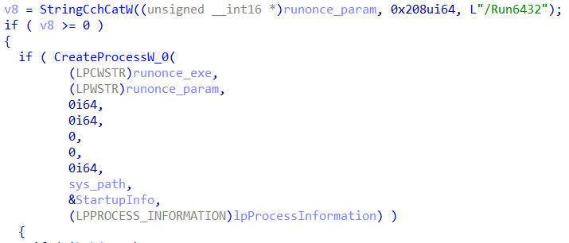
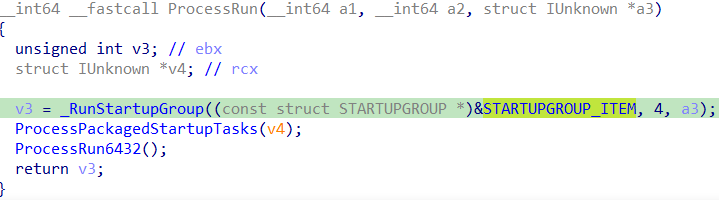
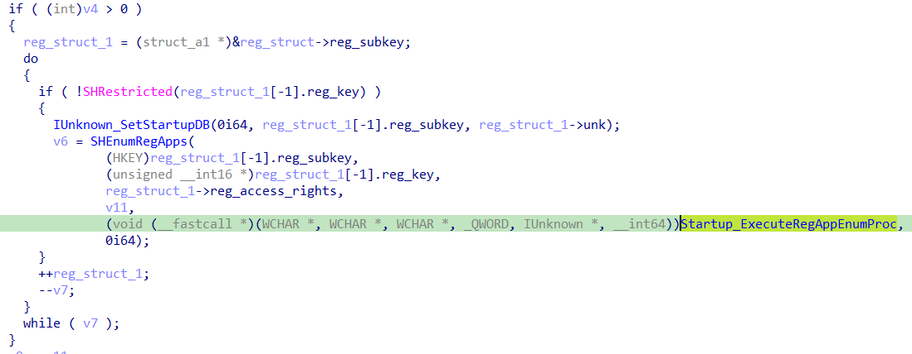
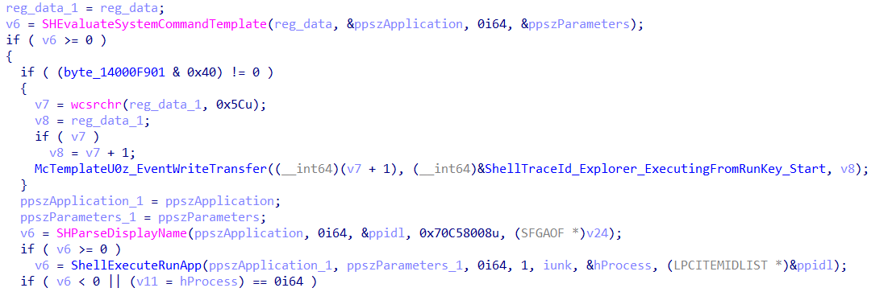
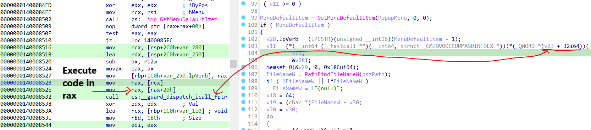

## Analysis For explorer.exe and runonce.exe

Performed quick static analysis for this one

Inside `ProcessRun6432()` function in `explorer.exe`, `runonce.exe` will be executed inside `SHCreateProcessWithArgs()`




Inside `runonce.exe`, the `ParseCmdLine()` will parse the paramenter that passed from `explorer.exe` and decide what to do next (In this case `/Run6432` is passed as parameter)  


`SHEnumRegApps` will read all the value data in `\Run` via `RegEnumValueW` and executes them one by one via `Startup_ExecuteRegAppEnumProc()`


`runonce.exe` will execute the binary stored in registry `\Run` via `rundll32.exe shell32.dll, ShellExec_RunDLL ?0x%X?%s` via `ExecuteRegAppEnumProc()` -> `Startup_ExecuteRegAppEnumProc()` -> `_ShellExecuteRegAppWithJobObject()`

`%s` contains the full path of the binary stored in registry `\Run`


## Analysis on "runonce.exe /AlternateShellStartup"


**(1)**
`ProcessRunOnce()` from HKLM registry can be execute if
`HKLM\Software\Microsoft\Windows\CurrentVersion\Explorer\SessionInfo\1\RunStuffHasBeenRun` removed

It will rerun the same executable with parameter `/RunOnce6432`

> Remember since it is HKLM, elevated permission required.  

There is **IsOS(0x1Eu)** check before moving into ``SHEnumRegApps()`.

> OS_WOW6432 (30, 0x1E) means the program is a 32-bit program running on 64-bit Windows


**(2)** The execution of `ProcessRun()` can be done with some modification on jump condition for GetSystemMetrics(0x43).

> SM_CMOUSEBUTTONS (0x43)  
The number of buttons on a mouse, or zero if no mouse is installed

This means It will only run before user login into their own session.  

After the flow modification, it will read the `\Run` data and execute via COM object.

In `ProcessRun()` function, It will load a hardcoded [struct STARTUP_ITEM](./struct_STARTUPGROUP_ITEM.txt)

The struct contains 2 registry key data as mentioned below:

- Software\Microsoft\Windows\CurrentVersion\Policies\Explorer\Run (HKCU/HKLM)
- Software\Microsoft\Windows\CurrentVersion\Run (HKCU/HKLM)



`_RunStartupGroup()` will load `SHEnumRegApps()` which will enumerate and load all the registry key value data in key in `strcut STARTUP_ITEM`. Then, these data will be load in  `Startup_ExecuteRegAppEnumProc()`.



Inside `Startup_ExecuteRegAppEnumProc()`, it will load `ExecuteRegAppEnumProc()` -> `_ShellExecuteRegAppWorker()` -> `ShellExecuteRunApp()`.



The `shell32.dll!CDefFolderMenu::InvokeCommand()` will execute the registry value data fetch from the registry key in `struct STARTUP_ITEM`.

`InvokeCommand()` will accept only one paramter with `struct _CMINVOKECOMMANDINFOEX` format.

Here is the variable assignment for the structure used in `ShellExecuteRunApp()`.

```c++
    v28.lpDirectoryW = a3;
    v28.cbSize = 0x68;
    v28.hwnd = 0i64;
    v28.fMask = 0x4500;
    v28.nShow = a4;
    v28.lpParametersW = a2;
```

Note: rax -> `shell32.dll!CDefFolderMenu::InvokeCommand()`.



Just wrote a PoC on file execution using `InvokeCommand` [here](https://github.com/ghoulgy/RandomCodes/blob/master/cpp/icontextmenu_invokecommand.cpp).

**(3)** After the execution of `ProcessRun()`, `ProcessPerUserRunOnce()`, only the value data from following registry will be loaded:

- Software\Microsoft\Windows\CurrentVersion\RunOnce (HKCU only)

Based on the flow of the code, you can simply add any files into `HKCU\...\RunOnce` and execute `runonce.exe /AlternateShellStartup`, it will execute any files inside the registry key and remove its key value afterwards.

## References

<https://medium.com/@boutnaru/the-windows-process-journey-userinit-exe-userinit-logon-application-650062f61df3>
<https://www.nutanix.com/sg/blog/windows-os-optimization-essentials-part-4-startup-items>
<https://github.com/Open-Shell/Open-Shell-Menu/blob/master/Src/ClassicExplorer/ExplorerBand.cpp>
<https://www.hexacorn.com/blog/2019/02/23/beyond-good-ol-run-key-part-104/>