# T1547.001 - Boot or Logon Autostart Execution: Registry Run Keys / Startup Folder

## The GUI appears and run the code

The calc.exe (just an example) will run and its interface will pop out.

- HKEY_CURRENT_USER\Software\Microsoft\Windows\CurrentVersion\Run
- HKEY_CURRENT_USER\Software\Microsoft\Windows\CurrentVersion\RunOnce
- HKEY_LOCAL_MACHINE\Software\Microsoft\Windows\CurrentVersion\Run
- HKEY_LOCAL_MACHINE\Software\Microsoft\Windows\CurrentVersion\RunOnce

- HKCR\CLSID\{645FF040-5081-101B-9F08-00AA002F954E}\shell\open\command  
Add your file path as registry data value in "(Default)" registry data name

> After setup the reg key, have to execute Recycle Bin to trigger this.

## Startup folder path

- HKEY_CURRENT_USER\Software\Microsoft\Windows\CurrentVersion\Explorer\Shell Folders  
Registry Data Name: Startup  
Registry Data Value: <YOUR_STARTUP_PATH>  

- HKEY_LOCAL_MACHINE\SOFTWARE\Microsoft\Windows\CurrentVersion\Explorer\Shell Folders  
Registry Data Name: Startup  
Registry Data Value: <YOUR_STARTUP_PATH>  

- HKEY_CURRENT_USER\Software\Microsoft\Windows\CurrentVersion\Explorer\User Shell Folders (Works)  
Registry Data Name: Startup  
Registry Data Value: <YOUR_STARTUP_PATH>  

- HKEY_LOCAL_MACHINE\SOFTWARE\Microsoft\Windows\CurrentVersion\Explorer\User Shell Folders (Works)  
Registry Data Name: Startup  
Registry Data Value: <YOUR_STARTUP_PATH>  

## No longer works in newer Windows version

- HKEY_LOCAL_MACHINE\Software\Microsoft\Windows\CurrentVersion\RunServicesOnce (Not default in Windows 10)
- HKEY_CURRENT_USER\Software\Microsoft\Windows\CurrentVersion\RunServicesOnce (Not default in Windows 10)
- HKEY_LOCAL_MACHINE\Software\Microsoft\Windows\CurrentVersion\RunServices (Not default in Windows 10)
- HKEY_CURRENT_USER\Software\Microsoft\Windows\CurrentVersion\RunServices (Not default in Windows 10)

## Run code in background only

The calc.exe (just an example) will run but its interface won't pop out.
Have to try will a simple script file (e.g. batch script)

- HKEY_LOCAL_MACHINE\Software\Microsoft\Windows\CurrentVersion\Policies\Explorer\Run
- HKEY_CURRENT_USER\Software\Microsoft\Windows\CurrentVersion\Policies\Explorer\Run

- HKEY_LOCAL_MACHINE\Software\Microsoft\Windows NT\CurrentVersion\Winlogon  
Registry Data Name: Userinit  
Registry Data Value: C:\Windows\system32\userinit.exe, <YOUR_FILE>  

- HKEY_LOCAL_MACHINE\Software\Microsoft\Windows NT\CurrentVersion\Winlogon  
Registry Data Name: Shell  
Registry Data Value: explorer.exe, <YOUR_FILE>  

## Analysis For explorer.exe and runonce.exe

Performed quick static analysis for this one

Inside `ProcessRun6432()` function in `explorer.exe`, `runonce.exe` will be executed inside `SHCreateProcessWithArgs()`

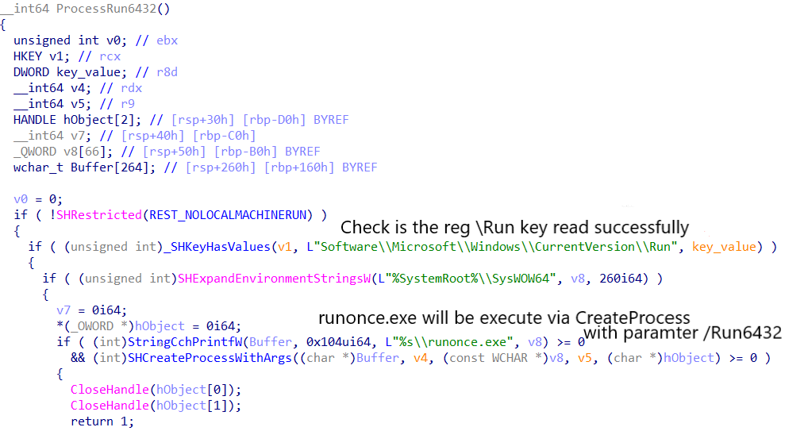

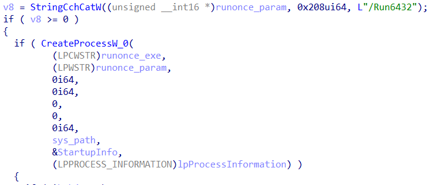

Inside `runonce.exe`, the `ParseCmdLine()` will parse the paramenter that passed from `explorer.exe` and decide what to do next (In this case `/Run6432` is passed as parameter)  

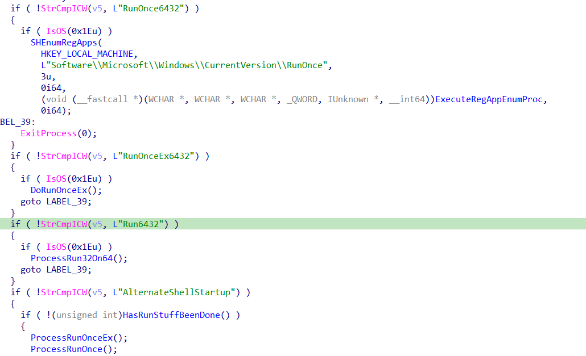

`SHEnumRegApps` will read all the value data in `\Run` via `RegEnumValueW` and executes them one by one via `Startup_ExecuteRegAppEnumProc()`

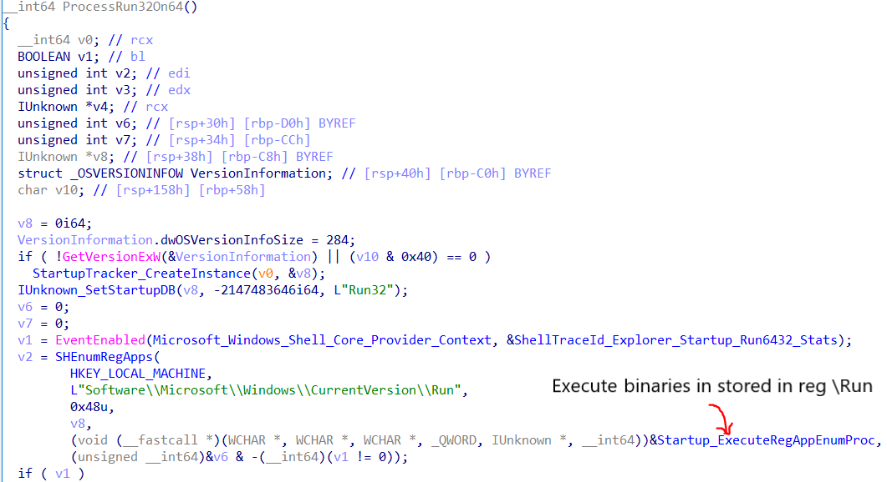

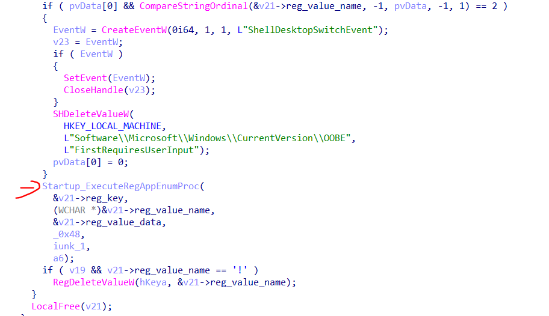

`runonce.exe` will execute the binary stored in registry `\Run` via `rundll32.exe shell32.dll, ShellExec_RunDLL ?0x%X?%s` via `ExecuteRegAppEnumProc()` -> `Startup_ExecuteRegAppEnumProc()` -> `_ShellExecuteRegAppWithJobObject()`

`%s` contains the full path of the binary stored in registry `\Run`

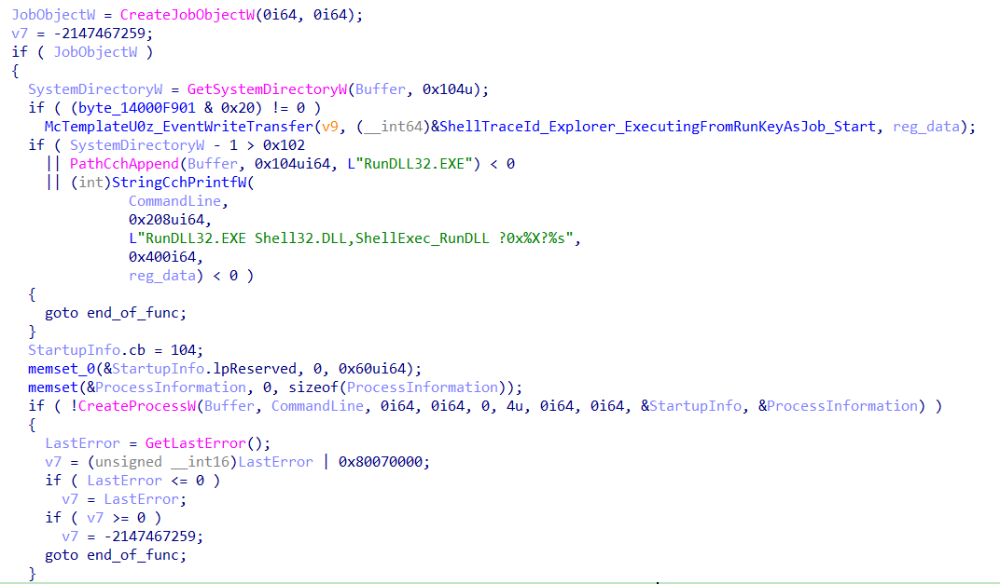

## Analysis on "runonce.exe /AlternateShellStartup"

Based on the direct execution of the commnad above with some modification on jump condition, it will read the `\Run` and `\RunOnce` data and execute via COM object.

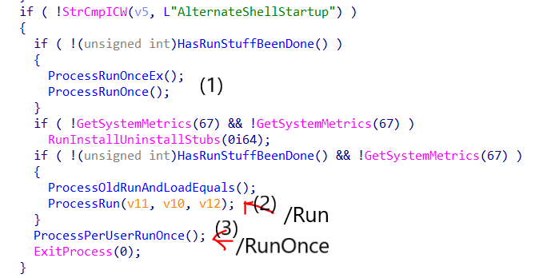

For example, in `ProcessRun()` function, It will load a hardcoded [struct STARTUP_ITEM](./struct_STARTUPGROUP_ITEM.txt)

The struct contains 2 registry key data as mentioned below:

- Software\Microsoft\Windows\CurrentVersion\Policies\Explorer\Run
- Software\Microsoft\Windows\CurrentVersion\Run

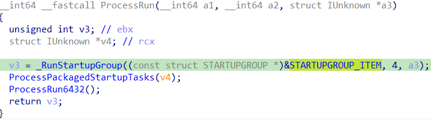

`_RunStartupGroup()` will load `SHEnumRegApps()` which will enumerate and load all the registry key value data in key in `strcut STARTUP_ITEM`. Then, these data will be load in  `Startup_ExecuteRegAppEnumProc()`

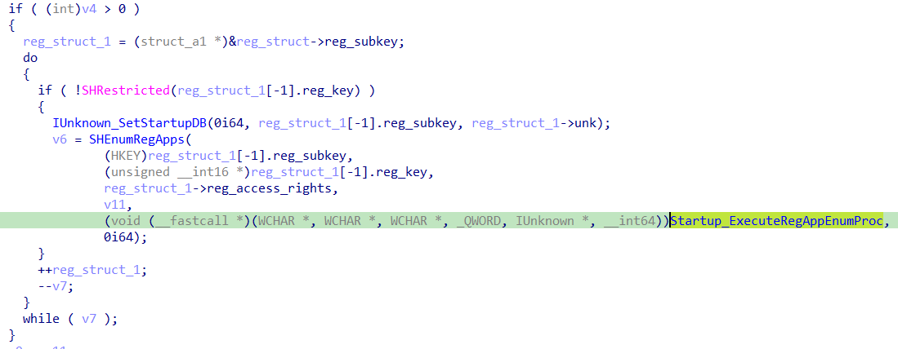

Inside `Startup_ExecuteRegAppEnumProc()`, it will load `ExecuteRegAppEnumProc()` -> `_ShellExecuteRegAppWorker()` -> `ShellExecuteRunApp()`

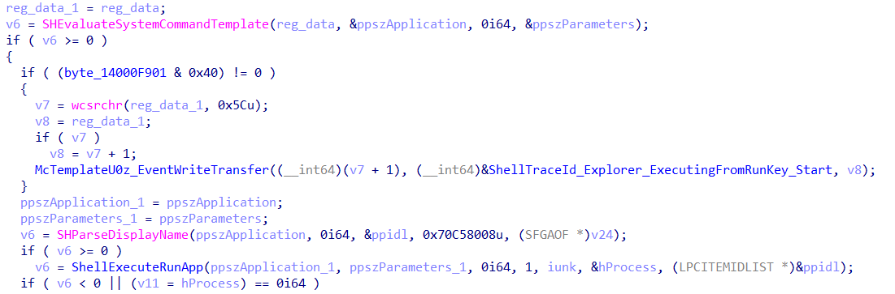

The `shell32.dll!CDefFolderMenu::InvokeCommand()` will execute the registry value data fetch from the registry key in `struct STARTUP_ITEM`

`InvokeCommand()` will accept only one paramter with `struct _CMINVOKECOMMANDINFOEX` format

Here is the variable assignment for the structure used in `ShellExecuteRunApp()`

```c++
    v28.lpDirectoryW = a3;
    v28.cbSize = 0x68;
    v28.hwnd = 0i64;
    v28.fMask = 0x4500;
    v28.nShow = a4;
    v28.lpParametersW = a2;
```

Note: rax -> `shell32.dll!CDefFolderMenu::InvokeCommand()`

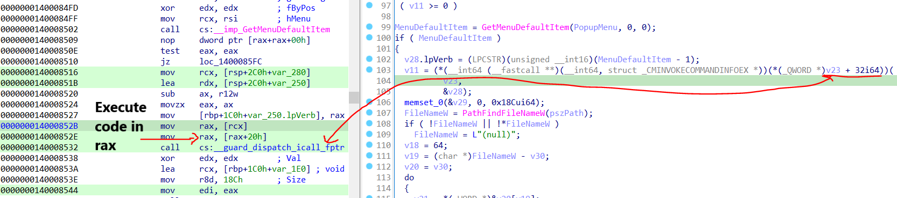

Just wrote a PoC on file execution using `InvokeCommand` [here](https://github.com/ghoulgy/RandomCodes/blob/master/cpp/icontextmenu_invokecommand.cpp)

## References

<https://medium.com/@boutnaru/the-windows-process-journey-userinit-exe-userinit-logon-application-650062f61df3>
<https://www.nutanix.com/sg/blog/windows-os-optimization-essentials-part-4-startup-items>
<https://github.com/Open-Shell/Open-Shell-Menu/blob/master/Src/ClassicExplorer/ExplorerBand.cpp>