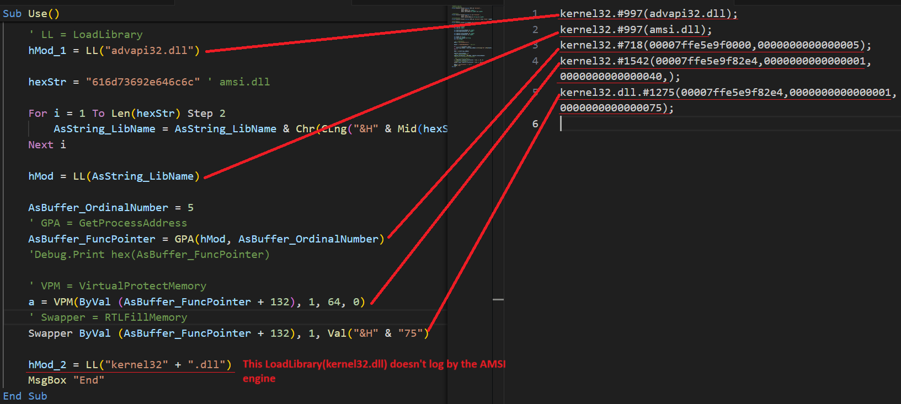
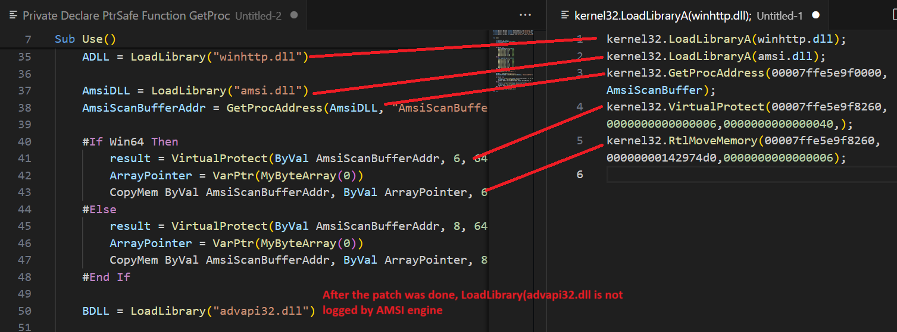
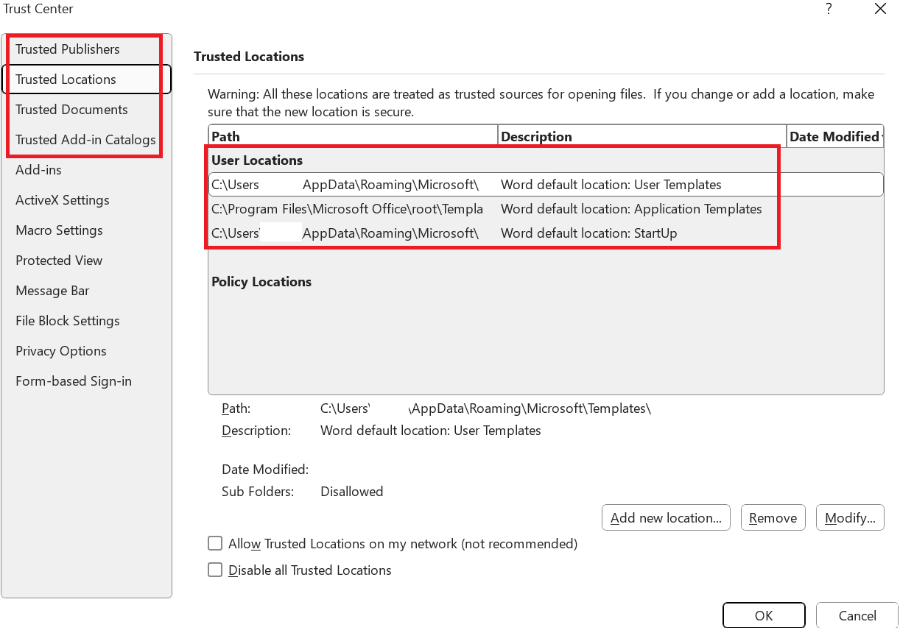
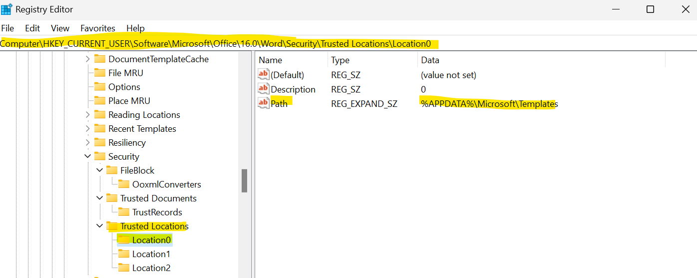
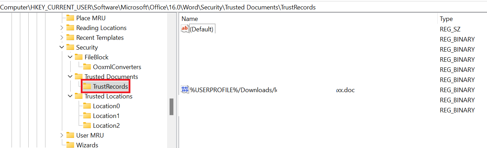
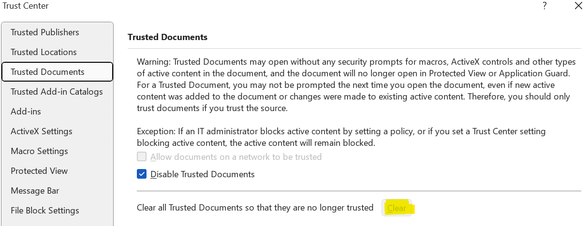
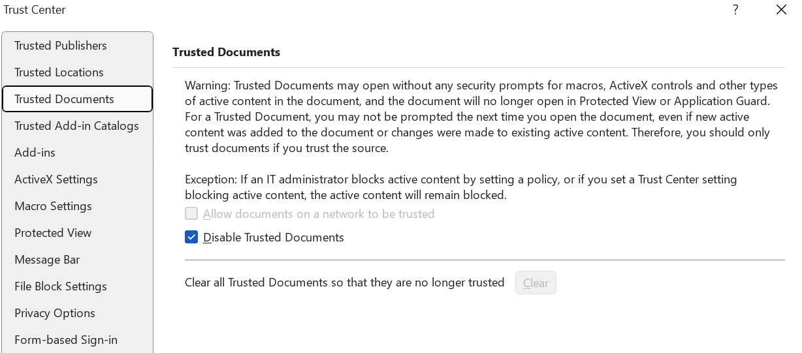
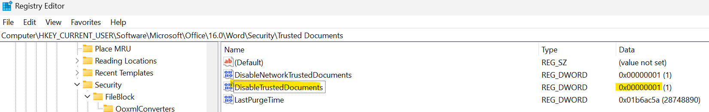

# AMSI Bypass with Macro

## How to Log AMSI Data

### AMSI-Tracer

Ez wae, using [amsi-tracer](https://github.com/manyfacedllama/amsi-tracer). Big shoutout to my ex-colleague 🦙

### Windows systool logman
Using `logman` based on the blog from [Red Canary](https://redcanary.com/blog/threat-detection/better-know-a-data-source/amsi/):

```
> logman start AMSITrace -p Microsoft-Antimalware-Scan-Interface Event1 -o AMSITrace.etl -ets

> logman stop AMSITrace -ets
```

#### Parsing etl using Get-AMSIEvent

Easy to use PowerShell module from [mgraeber-rc](https://gist.githubusercontent.com/mgraeber-rc/1eb42d3ec9c2f677e70bb14c3b7b5c9c/raw/64c2a96ece65e61f150daaf435dfc77aa88c8784/AMSITools.psm1).

```
> Import-Module AMSITools.psm1

> Get-AMSIEvent -Path <ETL_FILE_PATH>
```

#### Convert `.etl` to `.evtx`

`.etl` file can convert to `.evtx` file by using the command below:

```
> tracerpt c:\admin_wmi.etl -o c:\admin_wmi.etl.evtx -of EVTX
```

> The event viewer will crash if it loads large amount of bytes.

## Experiment

All these were tested in Windows 11 machine with O365 Office Suite.

Using the [AMSI bypass by ordinal script](https://github.com/ghoulgy/RandomCodes/blob/master/MacroScript/AMSI_Bypass/amsi_bypass_win_11.vba) modded from S3cur3Th1sSh1t's OffensiveVBA [collection](https://github.com/ghoulgy/RandomCodes/blob/master/MacroScript/AMSI_Bypass/amsi_bypass_win_11.vba). It can see that the Windows API is getting logged, but its real Windows API name has been obfuscated with the use of `Alias` syntax. However, the the hex strings representation of `amsi.dll` will get deobfuscated in this case due to the user mode API hook used by VBA AMSI to collect the event data, I guess (Need to reverse the relevant DLL for further confirmation). 

After the AMSI patch was done, it can see that the **last line** of LoadLibrary is **not recorded** into the AMSI log.



This is the AMSI log if executing [classic AMSI bypass script](https://github.com/S3cur3Th1sSh1t/OffensiveVBA/blob/main/src/AMSIBypass_AmsiScanBuffer_Classic.vba) vba. It can see that the function call string will logged directly by the AMSI engine. The function `AmsiScanBuffer` parameter also can be found in the `GetProcAddress` function. This might be too obvious and get detected by AntiVirus product.



## Trusted Folder

All truested documents/folder are **not be logged** by the AMSI scanner. Therefore it can use to bypass the AMSI detection.



The `Trusted Location` path can be found in the following registry key `HKCU\Software\Microsoft\Office\16.0\Word\Security\Trusted Locations\Location*`



### TrustedRecords

`TrustedRecords` indicates that the macro `Enable Content` has been approved by the user.



`TrustedRecords` registry key will not be seen if user remove via the following method:



## Hunting

### Using Literal String Keywords

Since in this case the only literal string can be found from the AMSI data log is the loaded DLL name and the passed paramters of the called Windows API function. For example, writing a amsi hunt rule if the log contains both `kernel32` and `amsi.dll`.

### Using mixed of Literal String Keywords, Hex Value and Ordinal Number

Some paramter in the function call can be useful for hunting. (e.g. 0x40 (RWX) in VirtualProtect, 0x75 in RTLFillMemory etc.) Using this can further reduce the FP. `Ordinal number` in `Alias` can be use too, but this is sometimes different for every windows version.

### Trusted folder

If the user click on `Enable Content` from the warning, this will registry the document recorded into registry key `TrustRecords`

## Quick Tips For Testing

To make the testing life easier, especially testing code within auto open function, it is good to tick on `Disable Trusted Documents`. This will make the `Enable Content` warning pop out every time when reopen the document again eventhough user already click on `Enable Content`.

> This will make the document did record into registry key `TrustRecords`



The following registry key will be added if user tick on `Disable Trusted Documents`



## References
[secureyourit AMSI bypass research](https://secureyourit.co.uk/wp/2019/05/10/dynamic-microsoft-office-365-amsi-in-memory-bypass-using-vba/)\
[idafchev AMSI bypass research](https://idafchev.github.io/research/2019/03/23/office365_amsi_bypass.html)\
[Mr-Un1k0d3r AMSI bypass scripts](https://github.com/Mr-Un1k0d3r/AMSI-ETW-Patch/blob/main/patch-amsi-x64-powershell_win11.ps1)\
[Disable/Enable trusted documents](https://www.thewindowsclub.com/enable-disable-trusted-documents-in-word-excel-powerpoint#:~:text=Search%20for%20regedit%20and%20click%20on%20the%20search,steps%20and%20name%20the%20key%20as%20trusted%20documents.)